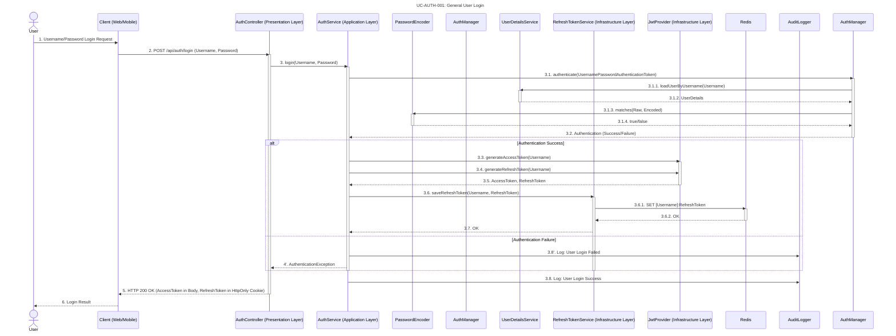
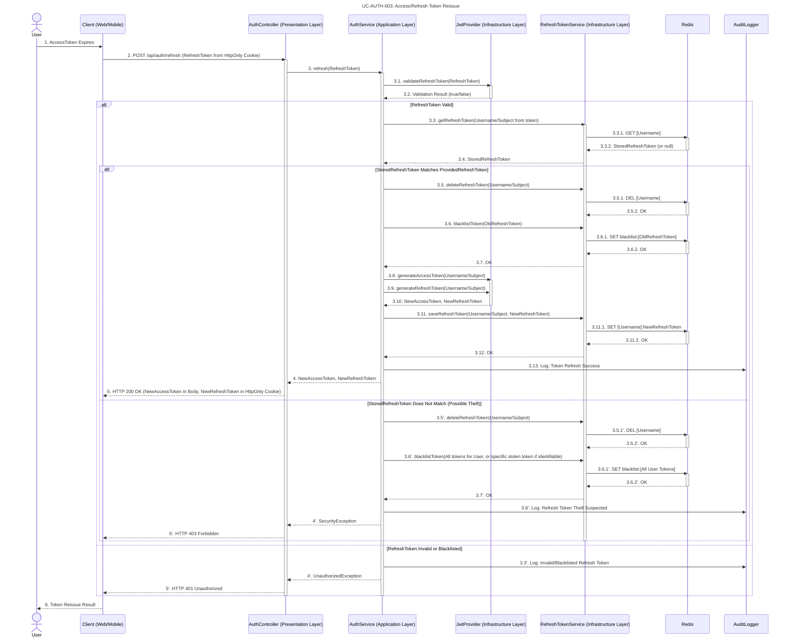
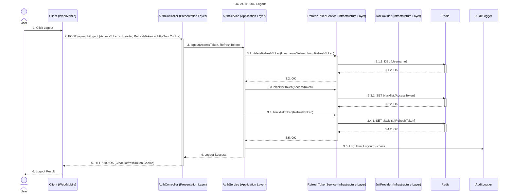

# Spring Boot에서 JWT 토큰 방식으로 서버 부담을 줄이고 보안을 강화하는 전략

## 서론: 좋은 아키텍처 위에 세우는 견고한 인증 시스템

이전 글 **[AI_Todo 프로젝트 개발기 #2] `extends`보다 `implements`를...** 에서는, 유지보수성과 테스트 용이성을 높이기 위해 인터페이스 기반의 느슨한 결합 아키텍처를 설계하는 원칙에 대해 다루었습니다.   

이제 그 아키텍처 위에 실제 서비스를 구현하고 사용자를 안전하게 식별하고, 보호할 수 있는 **인증(Authentication) 시스템** 을 구현해봤습니다.

Spring Boot 기반 백엔드 프로젝트에서, **세션 기반 인증**의 한계를 극복하고 서버 부담을 최소화하면서도 **강력한 보안**을 확보하기 위해, **JWT(JSON Web Token) 기반의 무상태 인증 시스템**을 도입했습니다.   

특히, 단순한 JWT 도입에 그치지 않고   

- **Refresh Token Rotation**
- **HttpOnly 쿠키 기반 토큰 전달**
- **Redis를 활용한 블랙리스트 관리**

등의 기법을 통해 보안성과 확장성을 동시에 고려한 설계를 구현했습니다.   

이번 글에서는 1편에서 다룬 설계를 바탕으로, `Auth` 도메인을 구현하면서 마주한 고민과 선택들, 그리고 JWT 인증부터 소셜 로그인(OAuth2) 연동까지의 전체 과정을 구체적으로 공유합니다.

## UseCase

*내용의 이해를 돕기 위해 use case를 도식화 했고 이미지를 클릭하면 확대해서 볼 수 있게 만들었습니다.*
*아래 이미지들은 클릭할 경우 마우스 휠로 확장해서 살펴 볼 수 있으니 참고해주세요*

#### 1. UC-AUTH-001: 일반 사용자 로그인 (General User Login)




#### 2. UC-AUTH-002: OAuth2 (Google) 로그인 (OAuth2 (Google) Login)

```mermaid
sequenceDiagram
    title UC-AUTH-002: OAuth2 (Google) Login
    actor User
    participant Client as Client (Web/Mobile)
    participant OAuth2 Provider as OAuth2 Provider (e.g., Google)
    participant AuthController as AuthController (Presentation Layer)
    participant SecurityFilter as Spring Security Filter Chain
    participant CookieAuthReqRepo as CookieOAuth2AuthorizationRequestRepository
    participant OAuth2UserService as CustomOAuth2UserService
    participant UserService as UserService (Application Layer)
    participant UserRepo as UserRepository (Infrastructure Layer)
    participant OAuth2AuthSuccessHandler as OAuth2AuthenticationSuccessHandler
    participant JwtProvider as JwtProvider (Infrastructure Layer)
    participant RefreshTokenService as RefreshTokenService (Infrastructure Layer)
    participant Redis
    participant AuditLogger

    User->>Client: 1. Click "Login with Google"
    Client->>SecurityFilter: 2. Redirect to /oauth2/authorization/google
    activate SecurityFilter
    SecurityFilter->>CookieAuthReqRepo: 2.1. saveAuthorizationRequest()
    activate CookieAuthReqRepo
    CookieAuthReqRepo-->>SecurityFilter: 2.2. OAuth2AuthRequest (in HttpOnly cookie)
    deactivate CookieAuthReqRepo
    SecurityFilter->>OAuth2 Provider: 2.3. Redirect for Authorization
    deactivate SecurityFilter

    OAuth2 Provider->>User: 3. Google Login/Consent Page
    User->>OAuth2 Provider: 4. Authorize Application
    OAuth2 Provider->>Client: 5. Redirect back with Authorization Code to /login/oauth2/code/google

    Client->>SecurityFilter: 6. Callback with Authorization Code
    activate SecurityFilter
    SecurityFilter->>CookieAuthReqRepo: 6.1. removeAuthorizationRequest()
    activate CookieAuthReqRepo
    CookieAuthReqRepo-->>SecurityFilter: 6.2. OAuth2AuthRequest (from cookie)
    deactivate CookieAuthReqRepo
    SecurityFilter->>OAuth2UserService: 6.3. loadUser(OAuth2UserRequest)
    activate OAuth2UserService
    OAuth2UserService->>UserService: 6.3.1. processOAuth2User(OAuth2User)
    activate UserService
    UserService->>UserRepo: 6.3.1.1. findByEmailOrCreate(email)
    activate UserRepo
    UserRepo-->>UserService: 6.3.1.2. User Entity
    deactivate UserRepo
    UserService-->>OAuth2UserService: 6.3.2. OAuth2UserPrincipal
    deactivate UserService
    OAuth2UserService-->>SecurityFilter: 6.4. Authentication (OAuth2UserPrincipal)
    deactivate OAuth2UserService
    SecurityFilter->>OAuth2AuthSuccessHandler: 6.5. onAuthenticationSuccess()
    activate OAuth2AuthSuccessHandler
    OAuth2AuthSuccessHandler->>JwtProvider: 6.5.1. generateAccessToken(UserPrincipal)
    activate JwtProvider
    OAuth2AuthSuccessHandler->>JwtProvider: 6.5.2. generateRefreshToken(UserPrincipal)
    JwtProvider-->>OAuth2AuthSuccessHandler: 6.5.3. AccessToken, RefreshToken
    deactivate JwtProvider
    OAuth2AuthSuccessHandler->>RefreshTokenService: 6.5.4. saveRefreshToken(UserPrincipal, RefreshToken)
    activate RefreshTokenService
    RefreshTokenService->>Redis: 6.5.4.1. SET [Username]:RefreshToken
    activate Redis
    Redis-->>RefreshTokenService: 6.5.4.2. OK
    deactivate Redis
    RefreshTokenService-->>OAuth2AuthSuccessHandler: 6.5.5. OK
    deactivate RefreshTokenService
    OAuth2AuthSuccessHandler->>AuditLogger: 6.5.6. Log: OAuth2 Login Success
    OAuth2AuthSuccessHandler-->>Client: 6.6. Redirect with Tokens (AccessToken in URL Fragment, RefreshToken in HttpOnly Cookie)
    deactivate OAuth2AuthSuccessHandler
    deactivate SecurityFilter

    Client-->>User: 7. OAuth2 Login Result (Redirected to Dashboard)
```


#### 3. UC-AUTH-003: Access/Refresh Token 재발급 (Access/Refresh Token Reissue)



#### 4. UC-AUTH-004: 로그아웃 (Logout)




## 1. 설계 원칙 적용하기: 왜 '인증'을 독립된 도메인으로 분리했는가?

1편에서 다룬 **헥사고날 아키텍처(Hexagonal Architecture)**의 핵심** 은 '애플리케이션의 핵심 로직(Domain)을 외부 관심사(Infrastructure)로부터 보호'하는 것입니다.    

이 원칙을 가장 먼저 **인증(Authentication) 기능에 적용** 했습니다. `Auth`를 별도의 독립된 도메인으로 분리함으로써, 인증 방식이 변경되거나 확장되더라도 다른 비즈니스 도메인에 미치는 영향을 최소화하고자 했습니다.

이를 위해 기존 세션 방식의 한계를 검토하고, Stateless 아키텍처에 적합한 **JWT 기반 인증 시스템**을 도입하게 되었습니다.

### 세션(Session) 기반 인증의 한계

세션 기반 인증은 서버가 사용자 상태를 직접 관리하므로, 다음과 같은 문제에 직면할 수 있습니다.

- **확장성(Scalability) 문제**: 여러 서버 인스턴스가 있을 경우, 세션 정보를 공유하기 위한 별도의 메커니즘(예: 세션 클러스터링, Sticky Session)이 필요해 복잡도가 증가합니다. 이는 마이크로서비스 아키텍처(MSA)에서는 특히 큰 단점으로 작용합니다.
- **CSRF(Cross-Site Request Forgery) 취약점**: 세션 ID가 쿠키에 저장되는 경우, CSRF 공격에 노출될 위험이 존재합니다.
- **모바일/크로스 도메인 이슈**: 웹 브라우저가 아닌 환경(모바일 앱)이나 도메인이 다른 클라이언트에서는 세션 쿠키를 다루기 어렵습니다.

### 단순 JWT(Access Token Only)의 한계

JWT는 토큰 자체에 사용자 정보를 담아 서버가 상태를 유지할 필요가 없는(Stateless) 장점이 있습니다. 그러나 Access Token만 사용할 경우 다음과 같은 문제가 발생할 수 있습니다.

- **보안 취약점 (탈취 시)**: `Access Token`의 유효 기간을 짧게 설정해도, 탈취된 토큰은 만료되기 전까지 유효하므로 보안에 취약합니다. 유효 기간을 길게 설정하면 더 큰 위험에 노출됩니다.
- **토큰 무효화의 어려움**: `JWT`는 토큰 자체로 검증되므로, 서버 측에서 특정 토큰을 즉시 무효화하기 어렵습니다. 사용자 로그아웃이나 비밀번호 변경 시 기존 토큰을 무효화하는 메커니즘이 필요합니다.

### 최종 선택: Access/Refresh Token 분리 + Redis + HttpOnly 쿠키

이러한 문제 인식 하에, 여러 프레임워크와 인증 방식을 검토하며 최적의 방안을 모색했습니다.

- **FastAPI**: 
	- 성능이 준수하고 비동기 처리에 강점이 있었지만, 상대적으로 보안 관련 레퍼런스나 커뮤니티가 적어 심도 있는 보안 구현에 대한 우려가 있었습니다. (개인 프로젝트였기에 학습 시간이 충분하지 않았습니다.)
- **Spring WebFlux**: 
	- 비동기/논블로킹의 장점이 명확했지만, 학습 곡선이 가파르고 난이도가 높아 프로젝트 초기 단계에 도입하기에는 부담이 있었습니다.
- **Django with DRF**: 
	- 파이썬 기반의 강력한 프레임워크지만, ORM 중심의 ActiveRecord 패턴을 강제하는 경향이 있어 NoSQL과 같은 다양한 DB 종류를 유연하게 사용하기 어렵다고 판단했습니다. 
	- 속도 면에서도 Spring에 비해 불리한 부분이 있다고 생각했습니다.

결론적으로, **Spring MVC가 가장 무난하면서도 엔터프라이즈 환경에서 검증된 안정성과 강력한 생태계를 제공**한다고 판단했습니다.   
하지만 Spring의 기본 동작 방식이 블로킹(Blocking) 기반이므로, 세션 저장 방식으로 인증을 구현하면 서버 부하가 높아질 것이라는 우려가 있었습니다.   
이에 **완전한 무상태(Stateless) 아키텍처를 지향하면서도 보안과 확장성을 동시에 잡을 수 있는 방안**을 모색했습니다.

이러한 배경 하에, **Access/Refresh Token 분리**하고 **Redis**와 **HttpOnly 쿠키**를 활용하는 방식을 채택했습니다.

- **Access Token**: 짧은 만료 기간(예: 5분)을 가지며, 실제 리소스 접근에 사용됩니다. 탈취되더라도 위험 노출 시간이 짧습니다.
- **Refresh Token**: 긴 만료 기간(예: 2주)을 가지며, `Access Token`이 만료되었을 때 새로운 `Access Token`을 발급받는 용도로만 사용됩니다.
- **Refresh Token Rotation**: `Refresh Token`을 한 번 사용할 때마다 새로운 `Refresh Token`을 발급하고 기존 Refresh Token은 무효화합니다. 이를 통해 `Refresh Token 탈취 시`에도 재사용이 어렵게 하여 보안을 강화합니다.
- **Redis 활용**: `Refresh Token`은 `Redis`에 저장하여 관리합니다. 이는 빠른 토큰 조회 및 블랙리스트 관리를 가능하게 하고, DB 부하를 감소시킵니다.
- **HttpOnly & Secure Cookies**: `Refresh Token`은 `HttpOnly 및 Secure 속성`을 가진 쿠키로 클라이언트에 전달하여 `XSS(Cross-Site Scripting)` 공격으로부터 보호합니다.

*이러한 접근 방식은 무상태 아키텍처의 장점을 살리면서도 보안을 강화하고, 토큰 무효화 등의 관리 용이성을 확보할 수 있다고 판단했습니다.*

## 2. Spring JWT, Redis, HttpOnly 쿠키 사용 이유 & 장점

### Spring JWT

- **Stateless 아키텍처 구현**: 
	- 서버가 클라이언트의 상태를 유지할 필요 없이, 토큰 자체로 인증 정보를 검증할 수 있어 서버 자원을 효율적으로 사용하고 수평 확장에 유리합니다. 
	- 이는 완전한 Stateless는 아니지만, Spring 서버의 확장을 충분히 가능하게 합니다.
- **분산 시스템에 적합**: 
	- 여러 마이크로서비스 간에 사용자 인증 정보를 공유해야 할 때, 각 서비스가 토큰을 독립적으로 검증할 수 있어 서비스 간 결합도를 낮출 수 있습니다.
- **산업 표준**: 
	- JWT는 웹 표준(RFC 7519)이며 널리 사용되므로, 다양한 클라이언트(웹, 모바일) 및 서드파티 서비스와의 통합이 용이합니다.

### Redis (Refresh Token 저장 및 블랙리스트 관리)

- **인메모리 데이터 스토어**: 
	- Redis는 데이터를 메모리에 저장하여 매우 빠른 읽기/쓰기 성능을 제공합니다. 
	- 이는 Access Token 재발급 시 Refresh Token 유효성 검증 및 블랙리스트 조회에 있어 핵심적인 이점입니다.
- **유연한 데이터 구조**: 
	- String, Hash, Set 등 다양한 데이터 타입을 지원하여 Refresh Token을 사용자 ID에 매핑하거나, 블랙리스트 토큰을 저장하는 데 효율적입니다.
- **만료 기능(TTL)**: 
	- Refresh Token의 만료 기간을 Redis의 TTL(Time-To-Live) 기능으로 쉽게 관리할 수 있어, 만료된 토큰을 자동으로 제거합니다.

### HttpOnly & Secure Cookies (Refresh Token 전달)

- **XSS (Cross-Site Scripting) 공격 방어**: 
	- `HttpOnly` 속성은 클라이언트 측 JavaScript가 해당 쿠키에 접근하는 것을 막을 수 있습니다. 
	- 이는 웹 애플리케이션의 가장 흔한 공격 벡터 중 하나인 XSS 공격으로부터 Refresh Token을 보호하는 핵심적인 메커니즘입니다. 
	- 만약 Refresh Token이 `HttpOnly`가 아닌 일반 쿠키나 로컬 스토리지에 저장된다면, 악성 스크립트가 실행될 경우 토큰이 쉽게 탈취될 수 있습니다.
	- `HttpOnly` 쿠키는 이러한 위험을 크게 줄일 수 있습니다.
- **네트워크 스니핑 방지**: 
	- `Secure` 속성은 해당 쿠키가 HTTPS 연결을 통해서만 전송되도록 강제합니다. 
	- 이는 중간자 공격(Man-in-the-Middle Attack)을 통해 토큰이 탈취될 위험을 감소시킬 수 있습니다. 
	- (개발 환경에서는 HTTPS 설정이 복잡할 수 있어 예외 처리가 필요할 수 있습니다.)
- **CSRF 공격 방어 (부분적)**:
	- `SameSite` 속성과 함께 사용하면 CSRF 공격에 대한 추가적인 방어가 가능합니다.

## 3. 구현 상세 내용: 설계 원칙을 코드로 옮기기

### User & Auth & common 디렉토리 구조

1편에서 설명한 **도메인-인프라 계층 분리 원칙**에 따라, `user`, `auth`, `common` 패키지를 아래와 같이 명확히 분리했습니다.   

각 패키지는 DDD의 계층형 아키텍처를 따르며, 이를 통해 각 도메인의 책임과 역할을 명확히 하고자 했습니다.   

향후 서버를 분리하게 될 경우, 공통으로 사용하는 부분은 최적화를 위해 `common` 패키지로 분리했습니다.   

예를 들어 `Auth` 도메인 서버를 따로 분리해서 운영해야 하는 경우, `common` 부분은 라이브러리로 만들어 임포트하고 `auth` 패키지를 분리할 수 있습니다.  

#### user 패키지

```text
user  
 ┣ application  
 ┃ ┣ dto  
 ┃ ┗ service  
 ┃ ┃ ┗ UserService.java  
 ┣ domain  
 ┃ ┣ event  
 ┃ ┃ ┣ UserRegisteredEvent.java  
 ┃ ┃ ┗ UserUpdatedEvent.java  
 ┃ ┣ exception  
 ┃ ┃ ┣ PasswordValidationException.java  
 ┃ ┃ ┣ UserNotFoundException.java  
 ┃ ┃ ┗ UserValidationException.java  
 ┃ ┣ model  
 ┃ ┃ ┣ Email.java  
 ┃ ┃ ┣ Gender.java  
 ┃ ┃ ┣ User.java  
 ┃ ┃ ┣ UserFactory.java  
 ┃ ┃ ┗ UserFactoryImpl.java  
 ┃ ┣ repository  
 ┃ ┃ ┗ UserRepository.java  
 ┃ ┗ service  
 ┣ infrastructure  
 ┃ ┣ config  
 ┃ ┗ persistence  
 ┃ ┃ ┣ entity  
 ┃ ┃ ┃ ┗ UserEntity.java  
 ┃ ┃ ┣ mapper  
 ┃ ┃ ┃ ┗ UserEntityMapper.java  
 ┃ ┃ ┣ JpaUserRepository.java  
 ┃ ┃ ┗ UserRepositoryImpl.java  
 ┗ interfaces  
 ┃ ┣ controller  
 ┃ ┃ ┗ UserController.java  
 ┃ ┣ dto  
 ┃ ┃ ┣ PasswordChangeRequest.java  
 ┃ ┃ ┣ UserRegisterRequest.java  
 ┃ ┃ ┣ UserResponse.java  
 ┃ ┃ ┗ UserUpdateRequest.java  
 ┃ ┗ mapper  
 ┃ ┃ ┗ UserResponseMapper.java
```

#### auth 패키지

```text
auth  
 ┣ application  
 ┃ ┣ dto  
 ┃ ┃ ┗ CustomOAuth2User.java  
 ┃ ┣ exception  
 ┃ ┗ service  
 ┃ ┃ ┣ AuthService.java  
 ┃ ┃ ┣ OAuth2UserService.java  
 ┃ ┃ ┗ UserEventListener.java  
 ┣ domain  
 ┃ ┣ exception  
 ┃ ┃ ┣ InvalidPasswordException.java  
 ┃ ┃ ┗ UserLockedException.java  
 ┃ ┣ model  
 ┃ ┃ ┗ AuthUser.java  
 ┃ ┣ repository  
 ┃ ┃ ┗ AuthUserRepository.java  
 ┃ ┣ service  
 ┃ ┃ ┗ AuthDomainService.java  
 ┃ ┣ CustomUserDetails.java  
 ┃ ┣ GoogleOAuth2UserInfo.java  
 ┃ ┣ OAuth2Provider.java  
 ┃ ┣ OAuth2UserInfo.java  
 ┃ ┗ OAuth2UserInfoFactory.java  
 ┣ infrastructure  
 ┃ ┣ external  
 ┃ ┣ persistence  
 ┃ ┃ ┣ entity  
 ┃ ┃ ┃ ┗ AuthUserEntity.java  
 ┃ ┃ ┣ mapper  
 ┃ ┃ ┃ ┗ AuthUserMapper.java  
 ┃ ┃ ┗ repository  
 ┃ ┃ ┃ ┣ AuthUserJpaRepository.java  
 ┃ ┃ ┃ ┗ AuthUserRepositoryImpl.java  
 ┃ ┣ AuthUserDetailsService.java  
 ┃ ┣ OAuth2UserInfoPrincipalExtractor.java  
 ┃ ┗ RefreshTokenService.java  
 ┗ presentation  
 ┃ ┣ controller  
 ┃ ┃ ┗ AuthController.java  
 ┃ ┗ dto  
 ┃ ┃ ┣ LoginRequest.java  
 ┃ ┃ ┣ LoginResponse.java  
 ┃ ┃ ┣ RefreshTokenRequest.java  
 ┃ ┃ ┗ TokenResponse.java
```

#### common 패키지

```text
common  
 ┣ config  
 ┃ ┣ OpenApiConfig.java  
 ┃ ┗ SwaggerConfig.java  
 ┣ exception  
 ┃ ┣ ErrorResponse.java  
 ┃ ┗ GlobalExceptionHandler.java  
 ┣ log  
 ┃ ┗ AuditLogger.java  
 ┗ security  
 ┃ ┣ infrastructure  
 ┃ ┃ ┗ config  
 ┃ ┃ ┃ ┗ SpringPasswordEncoderAdapter.java  
 ┃ ┣ jwt  
 ┃ ┃ ┣ JwtAuthenticationFilter.java  
 ┃ ┃ ┗ JwtProvider.java  
 ┃ ┣ oauth2  
 ┃ ┃ ┣ CookieOAuth2AuthorizationRequestRepository.java  
 ┃ ┃ ┗ OAuth2AuthenticationSuccessHandler.java  
 ┃ ┣ service  
 ┃ ┃ ┗ PasswordEncryptionService.java  
 ┃ ┗ SecurityConfig.java
```

 
### 1. JWT 토큰 발급 및 Redis 저장 구조

- `JwtProvider.java`: Access Token과 Refresh Token을 생성하는 핵심 로직을 담당합니다. 각 토큰은 고유한 비밀 키와 만료 시간을 가지며, JWT 생성 시 사용자 ID, 권한 등의 클레임(claims)을 포함합니다.
- `RefreshTokenService.java`:
	- **Refresh Token 저장**: 사
		- 용자가 로그인하거나 Access Token을 갱신할 때, 새로운 Refresh Token을 발급받아 Redis에 (사용자 ID, Refresh Token) 형태로 저장합니다. 
		- 기존 Refresh Token이 존재하면 덮어쓰거나, rotation 전략에 따라 삭제 후 새로 저장합니다.
	- **블랙리스트 관리**: 
		- 사용자가 로그아웃하거나 Access Token이 유효하지 않은 경우 (예: 탈취 의심), 해당 Access Token을 Redis에 블랙리스트로 등록하여 재사용을 방지합니다. 
		- 블랙리스트 등록 시 Access Token의 남은 유효 시간만큼 Redis TTL을 설정하여, 만료 후 자동으로 제거합니다.
	- **Refresh Token 유효성 검증**: 
		- Access Token 재발급 요청 시, Redis에 저장된 Refresh Token과 요청된 Refresh Token이 일치하는지 검증합니다.

- `AuthService.java`:
	- **로그인**: 
		- 사용자 인증 성공 시, `JwtProvider`를 통해 Access Token과 Refresh Token을 발급받습니다. 
		- Refresh Token은 `RefreshTokenService`를 통해 Redis에 저장하고, HttpOnly 쿠키로 클라이언트에게 전달합니다.
	- **토큰 갱신**: 
		- 만료된 Access Token과 유효한 Refresh Token이 있을 경우, Refresh Token을 이용하여 새로운 Access Token과 Refresh Token을 발급합니다. 
		- 이 과정에서 Refresh Token Rotation이 이루어지며, 기존 Refresh Token은 Redis에서 삭제됩니다.
	- **로그아웃**: 
		- 사용자의 Access Token과 Refresh Token을 무효화합니다. 
		- Access Token은 Redis 블랙리스트에 추가하고, Redis에 저장된 Refresh Token을 삭제합니다.

### 2. HttpOnly 쿠키로 토큰을 발급하는 이유와 보안적 장점

- **HttpOnly 쿠키는 클라이언트 측 스크립트(JavaScript)가 쿠키에 접근하는 것을 막습니다.** 
	- 이는 웹 애플리케이션의 가장 흔한 공격 벡터 중 하나인 XSS 공격으로부터 Refresh Token을 보호하는 핵심적인 메커니즘입니다. 
	- 만약 Refresh Token이 `HttpOnly`가 아닌 일반 쿠키나 로컬 스토리지에 저장된다면, 악성 스크립트가 실행될 경우 토큰이 쉽게 탈취될 수 있습니다.
	- `HttpOnly` 쿠키는 이러한 위험을 크게 줄일 수 있습니다.
- `Secure` 속성과 함께 사용하여 항상 암호화된 통신 채널을 통해 전송되도록 강제하는 것도 중요합니다.
- **네트워크 스니핑 방지**: `Secure` 속성은 해당 쿠키가 HTTPS 연결을 통해서만 전송되도록 강제합니다. 
	- 이는 중간자 공격(Man-in-the-Middle Attack)을 통해 토큰이 탈취될 위험을 감소시킬 수 있습니다.
- **CSRF 공격 방어 (부분적)**: `SameSite` 속성과 함께 사용하면 CSRF 공격에 대한 추가적인 방어가 가능합니다.

### 3. OAuth2 로그인에 JWT 적용 with Redis

기존의 세션 기반 OAuth2 인증을 JWT 기반으로 전환하기 위해 `OAuth2AuthenticationSuccessHandler`를 구현했습니다.

- `OAuth2AuthenticationSuccessHandler.java`:
    1. OAuth2 소셜 로그인 성공 시 Spring Security의 OAuth2 처리 후 호출됩니다.
    2. 이 핸들러는 로그인 시와 동일하게 `JwtProvider`를 통해 Access Token과 Refresh Token을 발급받고, `RefreshTokenService`를 통해 Refresh Token을 Redis에 저장합니다.
    3. 최종적으로 발급된 Refresh Token을 HttpOnly 쿠키로 클라이언트에게 전송하고, Access Token은 주로 HTTP Authorization 헤더의 Bearer 토큰 형태로 클라이언트에 전달됩니다.
    4. 이 과정에서 `AuthService`에 대한 순환 참조 문제를 해결하기 위해 `OAuth2AuthenticationSuccessHandler`가 `RefreshTokenService`에 직접 의존하도록 리팩토링했습니다.

### 4. Spring Security SessionCreationPolicy.STATELESS 설정에도 불구하고 JSESSIONID가 발급되는 문제 해결 과정

구현 및 테스트 과정에서 `SecurityConfig.java`에 `SessionCreationPolicy.STATELESS`를 명확히 설정했음에도 불구하고, 애플리케이션에 접근하면 `JSESSIONID` 쿠키가 계속 발급되는 현상을 발견했습니다.   

특히 `Whitelabel Error Page`, `H2 Console`, `Swagger UI` 같은 페이지에 접근했을 때 `JSESSIONID` 쿠키가 발생했습니다.  

이는 불필요한 세션 생성으로 인한 서버 리소스 낭비 및 잠재적인 DoS 공격 벡터가 될 수 있다고 판단했습니다.   
#### 원인 분석:

Spring Security의 `SessionCreationPolicy.STATELESS` 설정은 주로 자체 인증 필터 체인 내에서 세션 생성을 억제하지만, 서블릿 컨테이너 레벨의 기본 동작이나 특정 서드파티 라이브러리/프레임워크, 또는 Spring Boot의 기본 에러 처리 메커니즘 등은 여전히 암묵적으로 세션을 사용할 수 있다는 점을 인지하지 못했습니다.  

특히 OAuth2의 기본 `AuthorizationRequestRepository`가 세션을 사용하는 것이 큰 원인이었습니다.

#### 해결 방안 (구현 내용):

##### 1. OAuth2 `AuthorizationRequestRepository` 교체:

Spring Security OAuth2의 기본 `AuthorizationRequestRepository`는 세션을 사용하여 인증 요청을 저장합니다.  

이를 `Stateless` 방식으로 변경하기 위해 `CookieOAuth2AuthorizationRequestRepository`를 직접 구현하여 쿠키를 통해 인증 요청을 관리했습니다. 이 커스텀 저장소는 `SecurityConfig.java`에 등록하여 기본 세션 기반 구현체를 대체했습니다.

```java
    // ... 기존 코드 ...
    @Configuration
    @RequiredArgsConstructor
    public class SecurityConfig {
        private final OAuth2AuthenticationSuccessHandler oAuth2AuthenticationSuccessHandler;
        // ... (생략) ...
        @Bean
        public SecurityFilterChain securityFilterChain(HttpSecurity http) throws Exception {
            http
                // ... (생략) ...
                .sessionManagement(sessionManagement -> sessionManagement.sessionCreationPolicy(SessionCreationPolicy.STATELESS))
                .oauth2Login(oauth2 -> oauth2
                    .authorizationEndpoint(authorization -> authorization
                        // OAuth2 인증 요청을 세션 대신 쿠키에 저장하도록 설정                      .authorizationRequestRepository(cookieOAuth2AuthorizationRequestRepository())
                    )
            .successHandler(oAuth2AuthenticationSuccessHandler)
                );
                // ... (생략) ...
            return http.build();
        }
        // CookieOAuth2AuthorizationRequestRepository 빈 등록
        @Bean
        public CookieOAuth2AuthorizationRequestRepository cookieOAuth2AuthorizationRequestRepository() {
            return new CookieOAuth2AuthorizationRequestRepository();
        }
    }
```

이로써 OAuth2 로그인 과정에서 발생하는 불필요한 세션 생성을 방지할 수 있었습니다.
##### 2. Whitelabel Error Page 비활성화 및 커스텀 JSON 에러 핸들러 구현:

Spring Boot의 기본 `Whitelabel Error Page`는 HTML 페이지를 렌더링하는 과정에서 서블릿 컨테이너가 세션을 생성할 수 있습니다. 이를 방지하기 위해 `application.yml`에서 해당 기능을 비활성화했습니다.

```YAML
    server:
      error:
        whitelabel:
          enabled: false
```

그리고 모든 예외 상황을 JSON 형태로 응답하기 위해 `@RestControllerAdvice`를 활용한 `GlobalExceptionHandler`를 구현했습니다.   

이 핸들러는 `HttpServletRequest`를 파라미터로 받아 로그를 남기고, 클라이언트에게는 세션 생성을 유발하지 않는 JSON 에러 응답을 반환합니다.

```java
    // 
@Slf4j
@RestControllerAdvice
public class GlobalExceptionHandler {

	@ExceptionHandler(Exception.class)
	public ResponseEntity<Map<String, Object>> handleGlobalException(Exception ex, HttpServletRequest request) {
		log.error("Unhandled exception occurred: {}", ex.getMessage(), ex);
		log.error("Request URL: {}", request.getRequestURI());

		Map<String, Object> errorDetails = new HashMap<>();
		errorDetails.put("timestamp", LocalDateTime.now());
		errorDetails.put("status", HttpStatus.INTERNAL_SERVER_ERROR.value());
		errorDetails.put("error", "Internal Server Error");
		errorDetails.put("message", "An unexpected error occurred.");
		errorDetails.put("path", request.getRequestURI());

		return new ResponseEntity<>(errorDetails, HttpStatus.INTERNAL_SERVER_ERROR);
	}

	// ... 다른 커스텀 예외 핸들링 메서드 ...
}
```

이로써 API 엔드포인트뿐만 아니라 예외 발생 시에도 불필요한 세션이 생성되는 것을 막을 수 있었습니다.
##### 3. H2 Console 및 Swagger UI 접근 제한/설정 조정:

H2 Console이나 Swagger UI 같은 개발 도구들은 자체적으로 세션 관리 메커니즘을 가질 수 있다는 것을 알게 되었습니다.  
현재는 개발 편의성을 위해 기본 설정을 유지하되, 운영 환경 배포 시에는 반드시 이 부분을 재검토할 계획입니다.   

이러한 다각적인 접근을 통해 Spring Security의 `SessionCreationPolicy.STATELESS` 설정만으로는 해결하기 어려운 `JSESSIONID` 발급 문제를 효과적으로 해결할 수 있었고, 완전한 무상태 아키텍처에 한 발 더 다가갈 수 있었습니다.   

## 4. 설계 원칙의 구체적인 구현: DDD와 SOLID를 코드로 옮기기

1편에서 다룬 **'인터페이스 기반 의존성'** 과 **'도메인 계층의 독립성'** 과 같은 추상적인 원칙들은 실제 `Auth`와 `User` 도메인 코드에 어떻게 구현되었을까요?   

`DDD`와 `SOLID 원칙`을 바탕으로, 다음과 같은 패턴과 기법들을 적용하여 설계 단계의 고민을 실제 코드로 옮겼습니다.

- **인터페이스 기반 의존성 (DIP)**: 
	- `AuthService`, `JwtProvider` 등 주요 컴포넌트들은 구체 클래스가 아닌 인터페이스에 의존하도록 설계하여, 테스트 용이성과 구현체 교체의 유연성을 극대화했습니다.
- **Factory Pattern 활용**: 
	- OAuth2 소셜 로그인 사용자와 일반 사용자를 생성하는 복잡한 로직을 `UserFactory`로 캡슐화하여, 객체 생성의 책임을 도메인 내부로 숨기고 일관성을 유지했습니다.
- **Builder & Mapper Pattern 활용**: 
	- `User` 도메인과 DTO 간의 변환 로직을 `Mapper`로 분리하고, 불변 객체 생성을 위해 `Builder`를 사용하여 계층 간 결합도를 낮추고 데이터의 일관성을 확보했습니다.
- **Value Object 활용**: 
	- `Email`과 같은 단순 문자열이 아닌, 비즈니스 규칙을 포함하는 값 객체를 사용하여 도메인 모델의 표현력을 높이고 데이터 무결성을 강화했습니다.

## 5. 결론 및 회고: 앞으로의 개선 방향

이번 JWT 기반 인증 시스템 구축은 세션 기반 인증의 확장성 한계와 단순 JWT의 보안 취약점에 대한 이해도를 높여주었습니다.    

- **HttpOnly 쿠키를 통한 Refresh Token 보호 **
- **Redis를 이용한 효율적인 토큰 관리 및 블랙리스트 구현** 
- **Refresh Token Rotation 전략 도입**
- 
이러한 방법으로 보안 수준을 한층 높일 수 있었습니다. Redis를 활용하여 완전한 Stateless는 아니지만, CRUD 서버의 리소스 분산과 성능 향상을 동시에 도모할 수 있었던 점도 중요한 성과라고 생각합니다.   

처음에는 OAuth2 구현을 포함하여 직면하는 문제들을 해결하는 과정에서 부족한 점이 계속 보였고, 이런 부분들을 해결하려고 하다 보니 요구사항이 끝없이 확장될 수 있다는 것을 깨달았습니다.   

예상했던 시간을 계속 초과하게 되면서, 일단 **최소 기능(MVP)으로 서비스가 운영되고 보여줄 수 있는 결과물을 만드는 것이 중요하다는 판단**을 했고, 이번 단계에서는 이 정도로 마무리하고 다음 단계로 넘어가는 것이 더 효율적이라고 결론 내렸습니다.

### 향후 개선 방향

- **더욱 세분화된 권한 관리 (RBAC/ABAC)**: 
	- 현재는 기본적인 권한만 관리하고 있지만, 향후 더욱 복잡한 비즈니스 요구사항을 위해 역할 기반 접근 제어(RBAC) 또는 속성 기반 접근 제어(ABAC)를 도입하여 권한을 더욱 세분화할 필요가 있습니다.
- **강력한 감사 로깅 및 모니터링**: 
	- 현재 기본적인 보안 이벤트 로깅을 적용했지만, 로그인 실패, 토큰 탈취 시도, 비정상적인 접근 등 모든 보안 관련 이벤트를 중앙 집중식으로 로깅하고 모니터링하는 시스템을 강화해야 합니다.
- **Rate Limiting**: 
	- 인증 및 토큰 갱신 엔드포인트에 대한 요청 제한(Rate Limiting)을 적용하여 무차별 대입 공격이나 서비스 거부(DoS) 공격을 방지할 필요가 있습니다.
- **다중 요소 인증 (MFA)**: 
	- 보안 강화를 위해 다중 요소 인증(MFA) 옵션을 추가하는 것을 고려할 수 있습니다.
- **API Gateway 통합**: 
	- 마이크로서비스 아키텍처에서 API Gateway를 도입하여 중앙 집중식으로 인증 및 인가를 처리하고, 각 서비스는 순수한 비즈니스 로직에만 집중하도록 만들 수 있습니다.
- **토큰 만료 처리의 견고성**: 
	- Access Token과 Refresh Token의 만료 시점에 대한 클라이언트-서버 간 동기화 및 예외 처리 로직을 더욱 견고하게 만들 필요가 있습니다.

이번 프로젝트를 통해 실제 서비스에서 요구되는 보안과 확장성을 갖춘 인증 시스템을 구축하는 경험을 할 수 있었습니다.  

또한, 배우다 보면 신경 써야 할 부분이 끝이 없기 때문에 **필수적인 단계를 어디까지 정하고, 어느 선에서 다음 단계로 넘어가야 적절할지에 대한 고민**을 하며 많은 경험을 할 수 있는 시간을 가질 수 있었습니다.   


다음 *[AI_Todo 프로젝트 개발기 #4]* 에서는, 이번에 구축한 인증 시스템을 바탕으로 **DDD의 핵심 패턴인 애그리거트(Aggregate)와 도메인 이벤트(Domain Event)를 적용**하여, 더욱 견고하고 확장성 있는 `Todo` 도메인을 설계하고 구현하는 과정에 대해 깊이 있게 다뤄보겠습니다.   