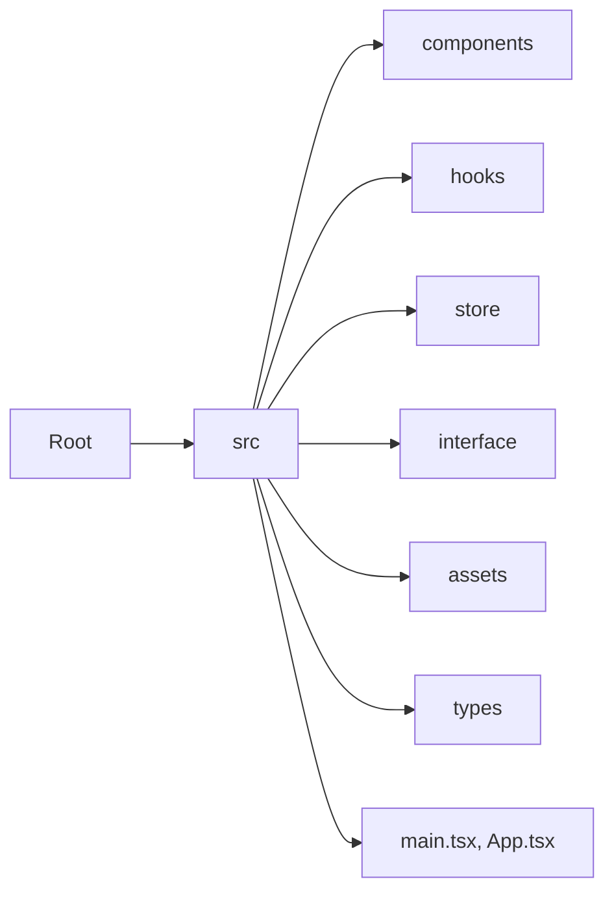
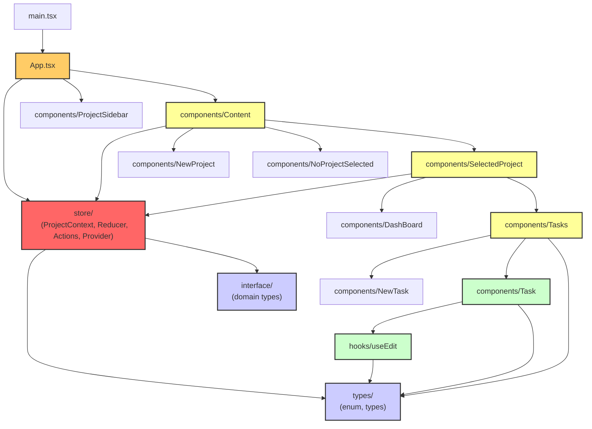
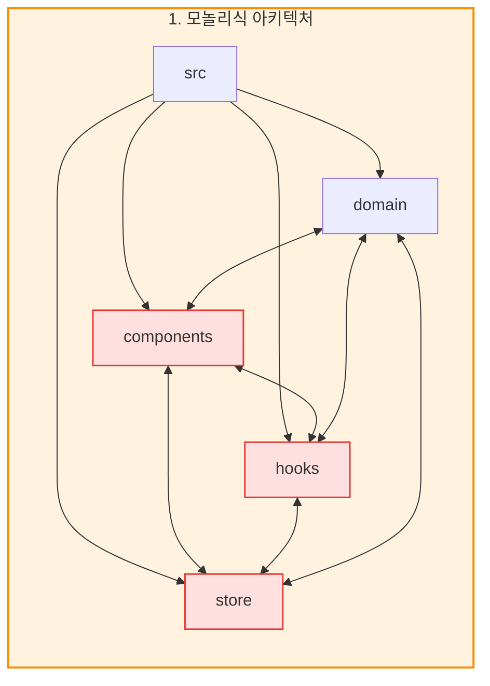
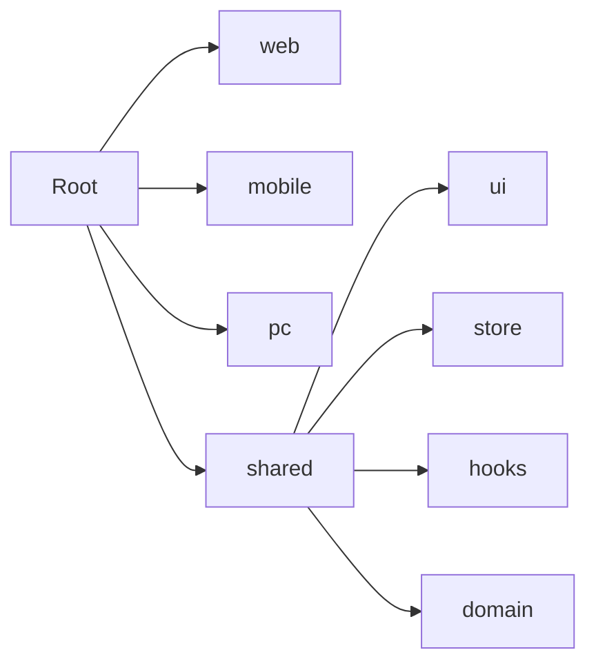
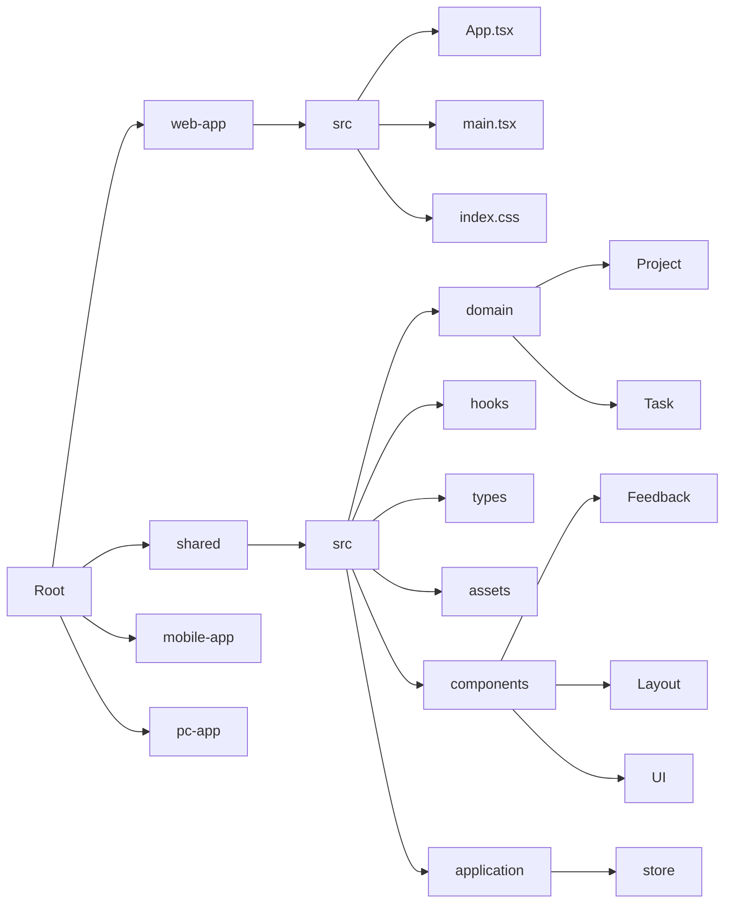
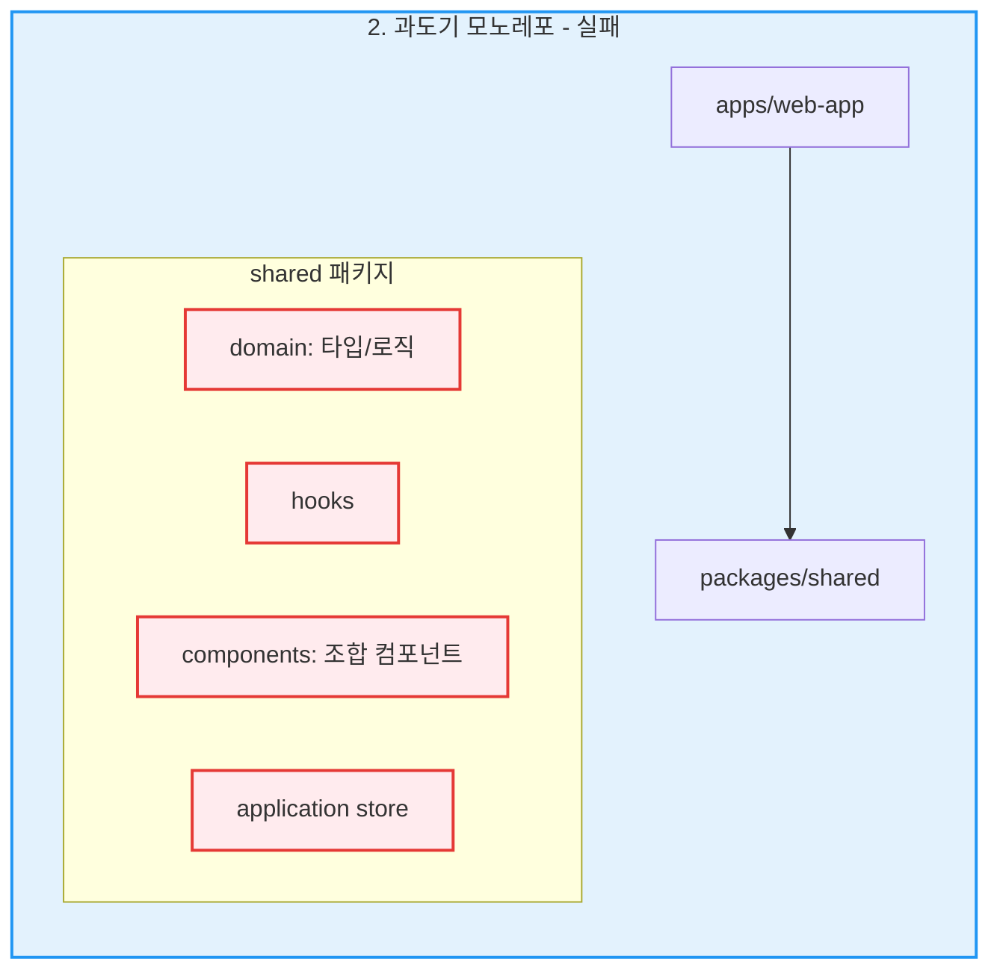

# 모든 문제의 시작, 순환참조

*[ AI_Todo 프로젝트 개발기 - Frontend #1 ] 모놀로프로 아키텍처 리팩토링을 선택한 이유*

## 1. 서론: 지뢰밭 같았던 첫 프론트엔드 프로젝트

제 첫 프론트엔드 프로젝트는 마치 지뢰밭 같았습니다...    
이 글은 기본 프론트엔드 구조에서 유지보수성과 확장성을 편하게 하기 위해 어줍잖게알았던 모놀로프 아키텍처로 전환하려다가 더 큰 함정에 빠졌고, 그 과정에서 무엇을 배웠는지에 대한 처절한 기록입니다.   

처음 프론트엔드 기술 스택으로 리액트를 선택한 이유는 명확했습니다.  

공통 컴포넌트를 만들어 리액트 네이티브(모바일)와 일렉트론(PC)으로 쉽게 확장하여 혼자서 모든 플랫폼을 개발하는 시간을 단축시키는 것이 목표였습니다.   

현재 학습하고 있는 특성상 구조는 언제든지 바뀔 수 있다고 생각했고 모바일과 동시에 개발하면서 구조변경에 용이하게 만드는 구조가 필수적이라고 생각했습니다.

그래서 외부 라이브러리 의존성을 최소화하고 React의 본질에 집중하고자 `Redux` 대신 `Context Hook` , `useReducer` 훅을 조합해 상태를 관리했습니다.   

이 선택이 훗날 의존성 지옥의 첫 단추가 될 줄은 꿈에도 모른 채 말이죠...

### 초기 모놀리식 아키텍처

#### 패키지 트리구조

```
src/
├── App.tsx
├── index.css
├── main.tsx
├── vite-env.d.ts
├── assets/
│   └── no-projects.png
├── components/
│   ├── Button.tsx
│   ├── Content.tsx
│   ├── DashBoard.tsx
│   ├── input.tsx
│   ├── Modal.tsx
│   ├── NewProject.tsx
│   ├── NewTask.tsx
│   ├── NoProjectSelected.tsx
│   ├── ProjectSidebar.tsx
│   ├── SelectedProject.tsx
│   ├── Task.tsx
│   └── Tasks.tsx
├── hooks/
│   └── useEdit.tsx
├── interface/
│   ├── project.ts
│   ├── projectContext.ts
│   └── task.ts
├── store/
│   ├── ProjectContext.tsx
│   ├── projectActions.ts
│   ├── projectReducer.ts
│   └── projects-context.tsx
└── types/
    ├── commonStatus.enum.ts
    ├── input.ts
    └── project.types.ts
```

#### 관계도



초기에는 하나의 src 폴더 안에 모든게 뒤섞여있는 전형적인 단일 React 프로젝트 구조였습니다.

### 모놀리식 아키텍처의 문제점

#### 각 컴포넌트들의 의존도 




#### 간소화 시킨 추상적인 구조




이 구조는 다음과 같은 심각한 문제들을 안고 있었습니다.

#### 1. 강한 결합과 순환 참조
모든 요소가 서로를 자유롭게 `import`할 수 있어 코드 베이스 전체에 거미줄 같은 의존성이 형성되었습니다.   

예를 들어,`components/Task`는 상태 변경을 위해 `store/projectActions`를 가져오고, `store`는 타입 정의를 위해 `types/project.types`를 참조하는데, 다른 컴포넌트에서 이 타입이 필요해지면서 모놀로프 아키텍처로 전환하려고 시도할 때 의존성 경로가 꼬여버리는 식이었습니다.  

결국 웹팩 빌드 과정에서 'Circular dependency' 경고가 발생하며, 심한 경우 애플리케이션이 제대로 렌더링되지 않는 현상을 겪어야 했습니다. 

#### 2. 재사용 및 확장 불가
코드를 분리하여 다른 프로젝트(예: 모바일 앱)에서 사용하는 것이 사실상 거의 불가능했습니다.   
또한 이러한 구조는 새로운 기능을 추가하거나 변경하려고 할 때 유지보수 비용이 오히려 기하급수적으로 증가하는 구조였습니다.   

#### 3. 비효율적인 개발 경험
생각했던 것과는 다르게 공통 로직들이 중복되어 일관성이 깨졌고 개발 속도를 저해했습니다.

이러한 문제를 근본적으로 해결하기 위해 `pnpm`과 `Turborepo`를 기반으로 한 모노레포 아키텍처로의 전환을 결정했습니다.   

### 목표 아키텍처




## 2. 1차 시도 - `shared` 패키지의 함정

모노레포를 처음 도입하며 코드를 `web-app`, `shared` 등으로 나누었습니다. 단순하게 공통으로 사용하는 부분만 `shared`에 몰아넣으면 될 거라 생각했습니다.



모노레포를 처음 도입하며 코드를 `web-app`, `mobile-app`, `pc-app`, `shared` 등으로 나누었지만, `shared` 패키지의 역할이 모호하여 실패한 단계입니다.



**문제는 `shared` 패키지였습니다.** 이 패키지 안에 도메인 타입, 비즈니스 로직, 상태 관리, 훅, UI 컴포넌트 등 너무 많은 책임이 뒤섞여 있었습니다. 그 결과 `shared`는 이름만 분리되었을 뿐, 실체는 '제2의 모놀리식'이 되어버렸습니다.   

`mobile`이나 `PC` 앱을 만들 때 `shared`에서 `domain` 타입만 가져다 쓰고 싶어도, `shared` 패키지 내부에 UI 컴포넌트나 웹 전용 훅이 얽혀있어 불필요한 코드까지 전부 의존해야 했습니다.    

이런 강한 의존성은 모노레포의 핵심인 `pnpm`과 `Turborepo`의 사용 의미마저 퇴색시켰습니다.    
Turborepo의 캐싱 기능을 통한 빠른 빌드가 핵심인데, `shared` 패키지 내부의 모든 코드가 서로 얽혀있으니 `domain`의 타입 하나만 변경해도 `shared` 패키지 전체가 캐시 무효화 대상이 되어버렸습니다.   

결국 매번 모든 코드를 새로 빌드하는 것과 다름없어져 모노레포의 장점을 전혀 살릴 수 없었습니다.   

쉽게 생각했던 리팩토링 작업은 처참한 실패로 끝나고, 이쯤 되니 '차라리 처음부터 다시 만드는 게 빠르지 않을까'하는 생각까지 들었습니다.    

> 첫 번째 깨달음: 폴더를 나누는 것과 책임을 분리하는 것은 전혀 다른 문제였다.
> 
> 나는 그저 코드를 여러 폴더(`shared`)로 옮기면 문제가 해결될 거라 착각했다. 하지만 각 폴더가 서로에게 어떻게 말을 걸어야 하는지에 대한 '규칙'과 '방향성'이 없었다.
> 
> 진정한 아키텍처 설계는 단순히 폴더 구조를 그리는 행위가 아니라, **'의존성의 방향을 제어하는 규칙'을 세우는 것**임을 뼈저리게 깨달았다.

---

첫 번째 리팩토링 시도가 실패한 후, 모든 것을 원점에서 다시 생각해야만 했습니다.

그냥 처음부터 만들어야 할까...?

다음 편에서는 이 지옥 같은 순환 참조를 원천적으로 차단하기 위해 세운 단 하나의 강력한 원칙, **'단방향 의존성 규칙'** 이 어떻게 탄생했고, 어떻게 파일을 옮기는 대수술을 감행했는지 그 생생한 과정을 공유하겠습니다.
