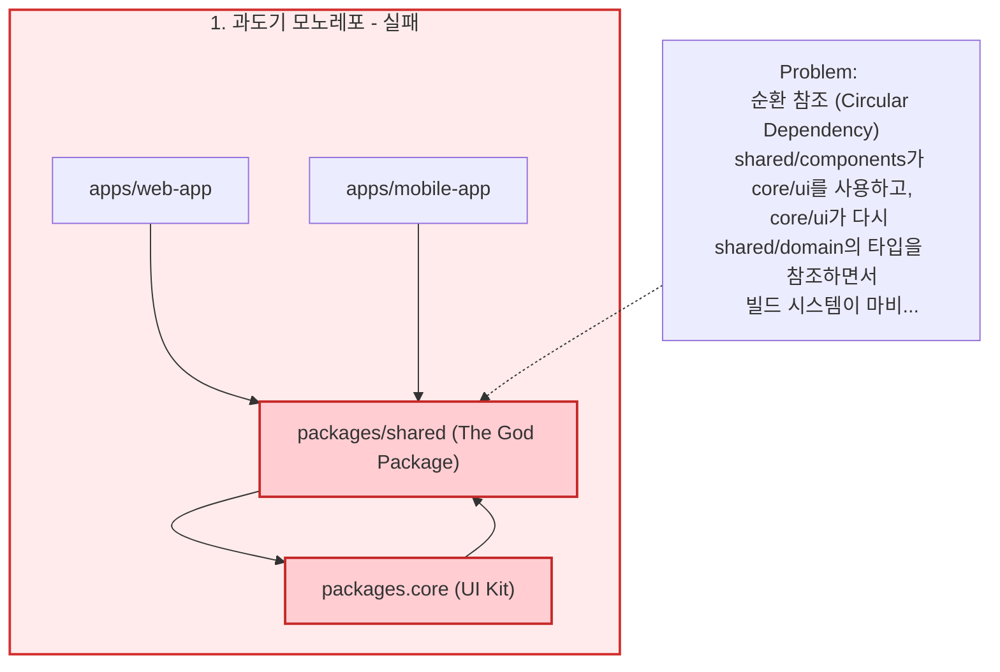
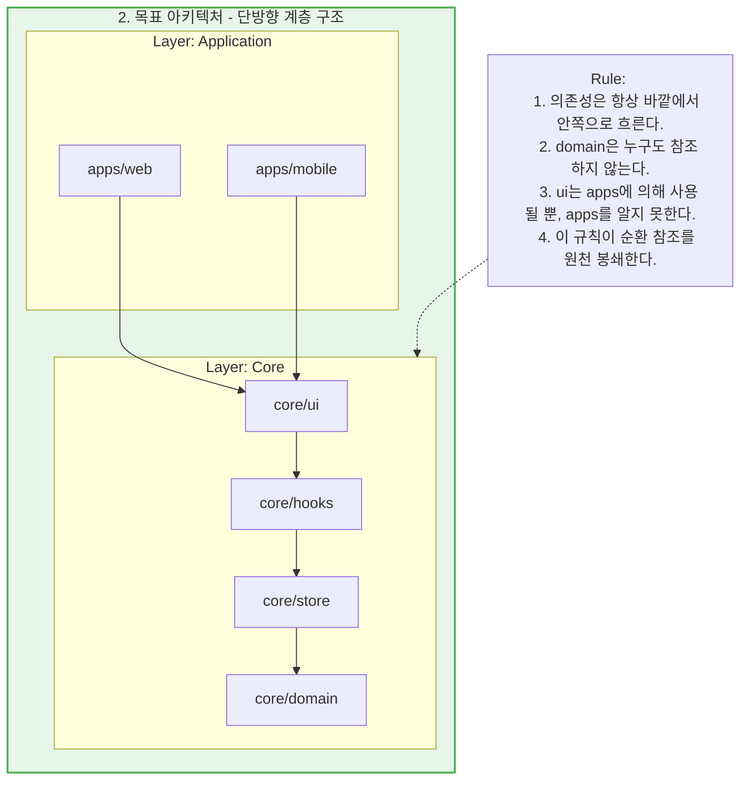
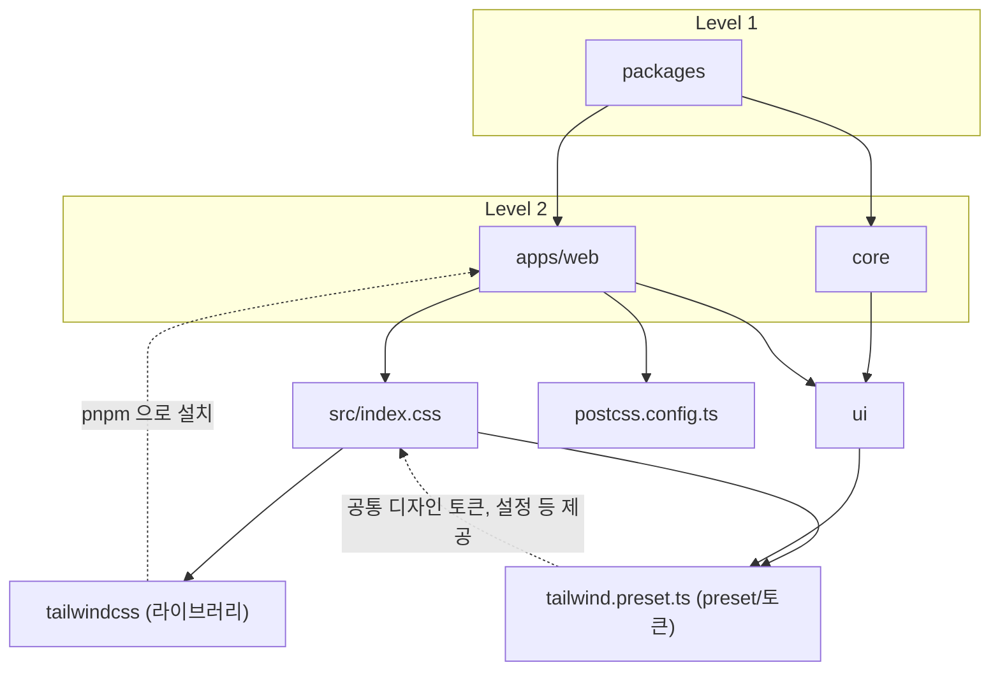
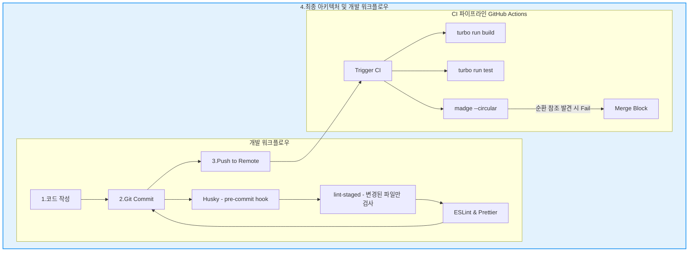
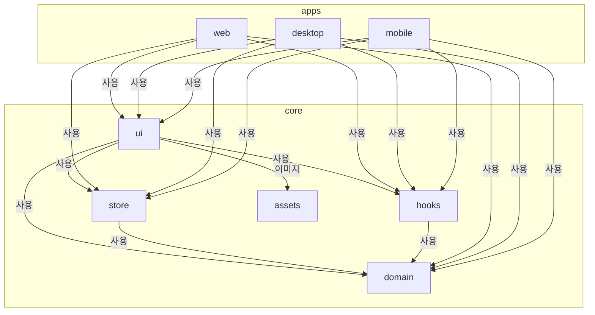
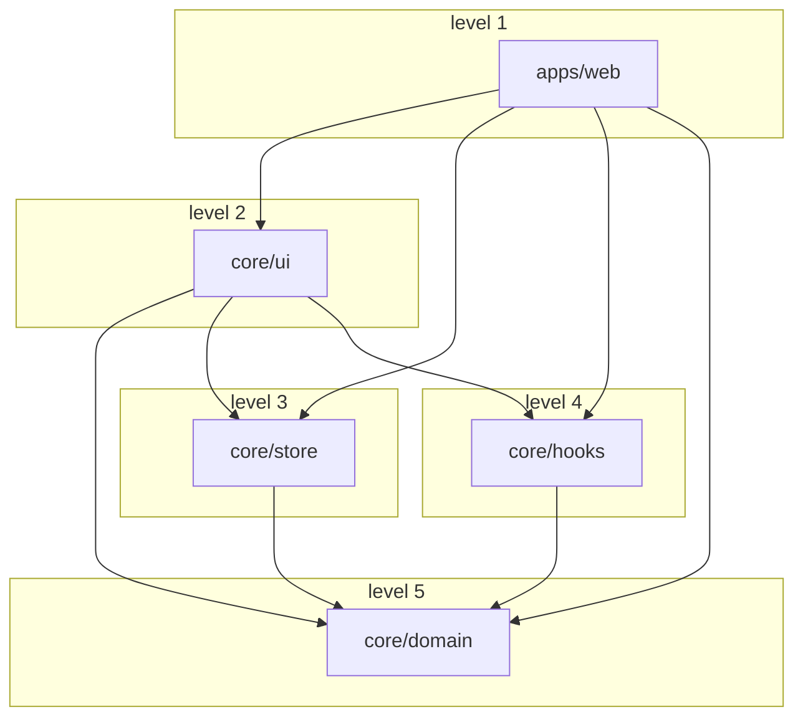
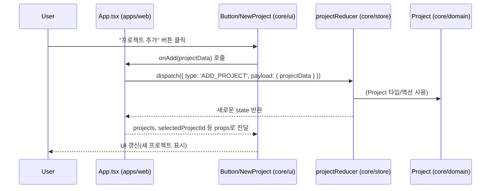
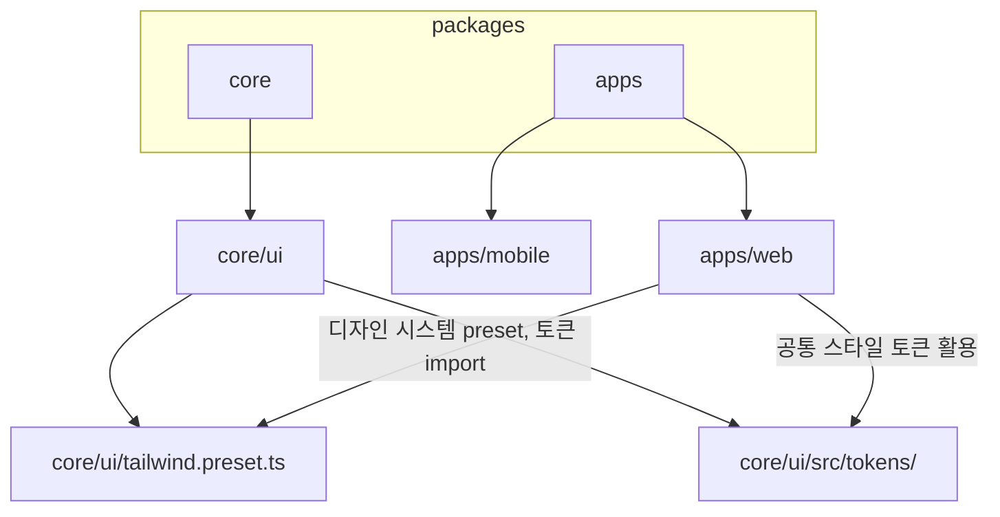
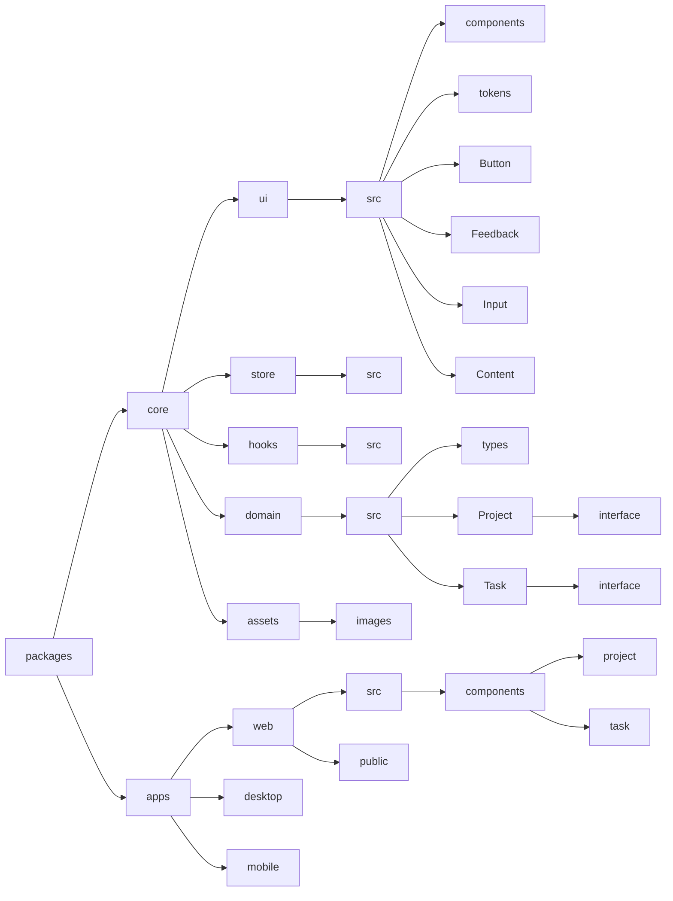

# 모놀리식에서 진화형 모노레포 아키텍처

*[ AI_Todo 프로젝트 개발기 - Frontend #2 ] 모노레포 쉽지 않네*

## 1. 서론: 배신자 `shared` 패키지... 해결책은 없을까?

1편에서 `shared` 패키지의 문제를 인식하고, 공통 로직을 `core`와 `shared`로 분리하려는 첫 시도를 했습니다.   
하지만 그 결과는 아래와 같이 `shared`와 `core`가 서로를 참조하는 거대한 순환 참조 지옥이었습니다.

### 1. 원인 분석 : `shared` 패키지는 왜 실패했는가?

우선 문제가 되는 순환참조를 끊어내기 전체적인 구조를 다시 정리했고 구조를 다시 정리해야했던 이유는 다음과 같습니다.  

- `shared` 패키지의 역할 과부하
	- `shared/components` 에서 `core/ui`를 분리하려고 하면, `core/ui`가 다시 `shared/domain`의 타입을 필요로 하면서 `shared ↔ core` 라는 거대한 순환 참조가 발생하여 작은 단위로 리팩토링 하는 게 불가능 했습니다.
- 플랫폼 종속성 문제
	- `shared` 패키지에 웹에서만 사용되는 `react-dom` , `tailwind` 같은 라이브러리가 포함되어, 모바일 앱에서 재사용하게 될 경우 문제가 될 수 있었습니다.
- 모호한 설정과 별칭 (Alias)
	- Vite, ESLint, TypeScript의 경로 별칭 설정이 서로 달라 '모듈을 찾을 수 없음' 오류가 빈번하게 발생했습니다.    
	- 또한 `@shared/*` 같은 단일 별칭은 구조 변경할 때마다 `tsconfig.json` 파일을 대규모 수정해야 했습니다.

### 2. 해결 전략 : 새로운 설계 원칙 수립

- `core`와 `apps`라는 명확한 2-계층 구조를 새로 설계
- `shared`라는 모호한 패키지를 완전히 해체
- **`core`:** 플랫폼에 독립적인 순수 로직과 UI를 담기
	- `domain`: 순수 비즈니스 로직과 타입
	- `store`: 상태 관리 로직
	- `ui`: 순수 프레젠테이셔널("Dumb") 컴포넌트
- **`apps`:** 실제 배포될 애플리케이션(웹, 모바일)을 위치시키고 비즈니스 로직과 상태를 아는 컨테이너("Smart") 컴포넌트를 배치
- `domain` → `store` → `hooks` → `ui` → `apps`로 이어지는 **엄격한 단방향 의존성** 규칙 정의
- **순환 참조 끊기:**
	- 빌드 실패의 주원인이었던 순환 참조를 해결하기 위해 `madge --circular` 같은 도구를 사용해 의존성 그래프를 분석
	- `Domain` 패키지에서 모든 React 컴포넌트를 제거하고 순수 타입과 로직만 남기기
	- `UI`는 `Store`를 직접 참조하지 않고, `Store`는 `Domain`만 참조하도록 의존성 방향을 단방향으로 강제 적용
- **`tsconfig.json` 문제 해결:**
	- `tsc -b` (프로젝트 참조 빌드) 시, 각 패키지의 `tsconfig.json`이 잘못된 상대 경로를 참조하거나(`extends`), `rootDir` 및 `references` 설정이 잘못되어 수많은 타입 에러(TS6307 등)가 발생 ->
		- 모든`tsconfig.json`의 경로를 수정하고, `references`를 단방향 의존성에 맞게 재설정하여 타입 빌드가 성공하도록 만들기
- **캐시 문제 해결:**
	- 이전 설정으로 인한 고질적인 오류를 예방하기 위해`node_modules`, `pnpm-lock.yaml`, `.turbo` 등 캐시 파일을 완전히 삭제하고 `pnpm install`로 클린 슬레이트에서 시작하는 과정을 반복

## 2. 해결을 위한 재설계

**핵심 원칙은 '엄격한 단방향 의존성'**

1. **`core/domain`:** 모든 의존성의 뿌리. 순수한 TypeScript 타입과 비즈니스 로직만 존재하며, 외부 라이브러리 외에는 아무것도 참조하지 않는다.
2. **`core/store`:** `domain`을 참조하여 상태 관리 로직(Zustand, Redux 등)을 정의
3. **`core/hooks`:** `store`와 `domain`을 참조하여 재사용 가능한 훅을 만든다.
4. **`core/ui`:** `hooks`와 `domain`을 참조할 수 있다. 
	1. 플랫폼에 독립적인 순수 "Dumb" 컴포넌트들의 집합
5. **`apps/*`:** 최종 애플리케이션. `core`의 모든 요소를 조합하여 비즈니스 로직을 완성하는 "Smart" 컴포넌트들이 위치

이 구조에서는 **어떤 패키지도 자신보다 바깥 계층의 패키지를 참조할 수 없습니다.** 예를 들어, `ui` 패키지는 `apps/web`을 절대 `import` 할 수 없습니다. 이 단순하지만 강력한 규칙이 순환 참조를 원천적으로 방지하는 안전장치가 됩니다.   
-> 어떻게? 
	husky 를 사용하여 커밋을 할 때 eslint와 순환참조 검사 스크립트등 여러 조건을 걸어두고 해당 조건을 통과하지 못 할 경우 커밋을 강제적으로 막게 설계

> **두 번째 깨달음:** 좋은 아키텍처는 개발자의 주의력에 의존하는 것이 아니라, 구조 자체로 실수를 방지해야 한다. **규칙을 코드로 강제할 수 있는 시스템**이 필요하다.

### 수정된 아키텍처

---

## 3. 대수술 - 리팩토링의 최전선에서 마주한 문제들

계획은 완벽해 보였지만, 현실은 험난했습니다. 파일을 옮기고, 여러 `import` 구문을 바꾸고, 모든 설정 파일을 새 구조에 맞게 수정하는 대장정이었습니다. 이 과정에서 마주했던 주요 문제와 해결책은 다음과 같습니다.

#### 문제 1: 설정 파일의 지옥 (tsconfig, Vite, Tailwind)

`pnpm` 워크스페이스와 `Turborepo` 환경에서 설정 파일들은 서로 다른 기준점으로 경로를 해석했습니다. 특히 `tsconfig.json`의 `references`와 `paths` 설정은 지옥 그자체 였습니다.   

`tsc -b`로 빌드 시, 패키지 간 참조 경로가 맞지 않아 수많은 `TS6307: File is not listed within the file list of project` 에러가 발생했습니다...

#### 해결책

- **설정의 중앙화와 상속:** 
	- 공통 설정을 담은 `tsconfig.base.json`을 루트에 두고, 각 패키지는 이를 `extends` 하되 `references`와 `paths`는 자신의 위치를 기준으로 명확히 재정의했습니다.
- **Tailwind CSS Preset:** 
	- `core/ui`에 `tailwind.preset.ts`를 만들어 공통 설정을 정의하고, 각 `apps`에서는 이 프리셋을 `import`하여 확장하는 방식으로 중복을 제거하고 일관성을 유지했습니다. 

#### Tailwind 라이브러리 구조

#### 문제 2: 히드라 같은 순환 참조와의 전쟁

파일을 기능별로 분리했음에도 불구하고, 여전히 숨어 있던 순환 참조가 지속적으로 빌드 오류를 발생시켰습니다.   

빌드할 때마다 이러한 에러를 일일이 확인하는 작업은 예상보다 훨씬 많은 시간과 에너지를 소모했습니다.   

작은 규모의 프로젝트임에도 이런 식으로 반복적인 비용이 발생한다면, 추후 유지보수나 확장성을 고려할 때 **자동화가 반드시 필요하다**는 결론에 도달했습니다.   

이런 ‘노가다성 작업’은 정말 귀찮을 뿐 아니라, 정신적으로도 큰 피로를 유발했고, 결과적으로 **생산성까지 크게 저하**시켰습니다.   

“어떻게 하면 더 효율적으로, 꿀을 빨 수 있을까”라는 생각과 함께, 앞으로의 방향성과 동기부여를 다잡게 되었습니다.   

물론 편하게 개발하고 싶다는 욕심도 있었지만, 모바일 개발을 시작할 걸 생각하면, 이러한 반복 작업은 초기 비용이 좀 들더라도 **반드시 해결해야 할 과제**라고 느꼈습니다.   

#### 해결책

- **의존성 그래프 시각화: 
	- ** `madge --circular ./` 명령어를 통해 순환 참조가 발생한 파일들을 직접 눈으로 확인했습니다.
- **원칙에 따른 의존성 절단:** 
	- `madge`가 알려준 순환 고리를 보며, '단방향 의존성' 원칙에 어긋나는 `import` 구문을 찾아내 제거하거나, 필요한 로직을 더 낮은 계층의 패키지로 이동시키는 방식으로 모든 고리를 끊어냈습니다.

#### 문제 3: 신뢰할 수 없는 별칭(Alias)

과거에 사용하던 `@shared/*` 같은 루트 기반 단일 별칭은 패키지 구조가 바뀌자 재앙이 되었습니다. 모든 `import` 경로를 수동으로 수정해야 했습니다.

#### 해결책

- **패키지 기반 별칭 도입:**
	- `@core/ui/*`, `@apps/web/*`처럼 패키지 이름을 그대로 별칭으로 사용했습니다. 이는 코드가 어떤 패키지에 의존하는지 명확히 보여주며, 설정을 더 직관적으로 만들 수 있었습니다.
- **Codemod 활용:** 
	- 여러 개의 `import` 구문을 바꾸기 위해 AST(추상 구문 트리)를 활용한 간단한 Codemod 스크립트, **프로그램 소스 코드를 분석하고 자동으로 수정하는 프로그램**을 작성하여 변경 작업을 자동화했습니다.

> **세 번째 깨달음:** "가정하지 말고, 항상 확인하라." 캐시가 문제일 것이라, 설정이 맞을 것이라 가정하지 않고 `node_modules`, `.turbo` 캐시를 모두 지우고 클린 슬레이트에서 빌드하며 문제의 진짜 원인을 찾아야 했어야 한다. 
> 
> 또한, **설정 파일은 단순한 메타데이터가 아니라, 프로젝트의 뼈대를 이루는 중요한 '코드'**임을 명심해야 한다.
> 
> ( 귀찮다고, 시간 오래걸린다고 회피하려다 더 귀찮아진다.... )

---

## 4. 안정화 - 품질을 지키는 자동화 시스템 구축

대수술이 끝난 후, 이 건강한 구조가 다시 망가지지 않도록 유지하는 시스템을 구축했습니다.

- **Dual Test Runner Strategy:** 
	- Vite 기반의 웹 프로젝트에는 **Vitest**를, React Native 환경의 모바일 프로젝트에는 **Jest**를 도입하여 각 환경에 최적화된 테스트 환경을 구축했습니다. `turbo run test` 명령 하나로 모든 테스트가 병렬 실행됩니다.
- **품질 자동화:** 
	- `husky`와 `lint-staged`를 사용하여, 개발자가 `commit`을 할 때마다 변경된 파일에 한해 자동으로 린트와 포맷팅 검사를 수행합니다.
- **CI를 통한 아키텍처 수호:**
	- GitHub Actions 워크플로우에 `madge --circular` 체크를 추가했습니다. 이제 실수로 순환 참조를 유발하는 코드를 푸시하면, CI 단계에서 빌드가 실패하며 Merge를 원천적으로 차단합니다.  
	- 아키텍처 규칙이 더 이상 사람의 기억이 아닌, 시스템에 의해 강제되도록 만들었습니다.

## 5. 완성된 아키텍처

### 1. 현재 아키텍처에서 apps 와 core의 의존관계

#### 예 : web app의 흐름도

- core 에서서 의존방향 규칙을 준수한다면 web에서 어떻게 사용하든 상관이 없다.

#### 데이터/액션 흐름

### 2. 각 앱의 공유 라이브러리 의존 관계 (예 : tailwindCSS)

### 3. 리팩토링된 현재 프로젝트 구조

## 6. 결론: 리팩토링은 코드를 넘어 시스템을 재설계하는 과정

이번 리팩토링은 단순히 낡은 코드를 정리하는 작업이 아니었습니다. **'문제의 근본 원인을 파악하고, 재발을 방지하는 시스템을 설계하며, 그 원칙을 따를 수 있도록 자동화하는'** 과정이었습니다.   

돌이켜보면, 힘들었지만 지옥 같았던 빌드 에러와 순환 참조는 제가 더 좋은 개발자가 될 기회가 되었습니다.   

이런 경험들은 제가 에러 메시지 뒤에 숨은 구조적 문제를 볼 수 있게 되었고, 더 견고하고 확장 가능한 시스템을 자신 있게 설계할 수 있는 능력을 갖추게 되었다고 생각합니다.

만약 프로젝트가 알 수 없는 버그와 느린 빌드 속도에 시달리고 있다면, 의존성 그래프를 확인하는 걸 추천합니다.

아마도 그 거미줄 속에, 진짜 문제가 숨어있을 확률이 높습니다..

다음 글에서는 이러한 설계 원칙 위에서 구현된 **인증(Auth)과 Auth 도메인**에 대해 깊이 있게 다뤄보겠습니다.