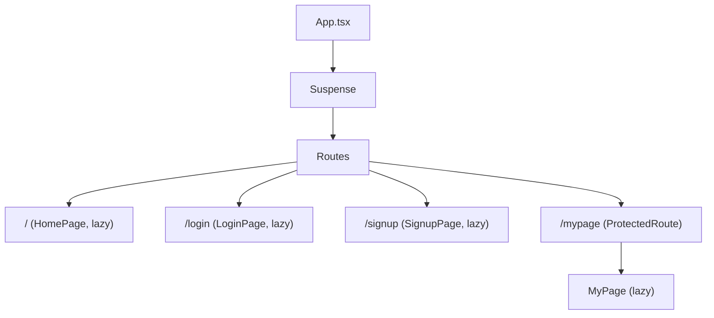
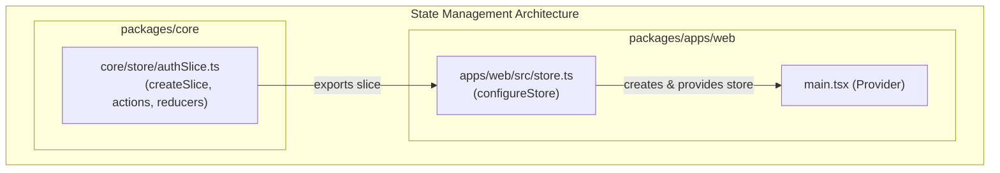
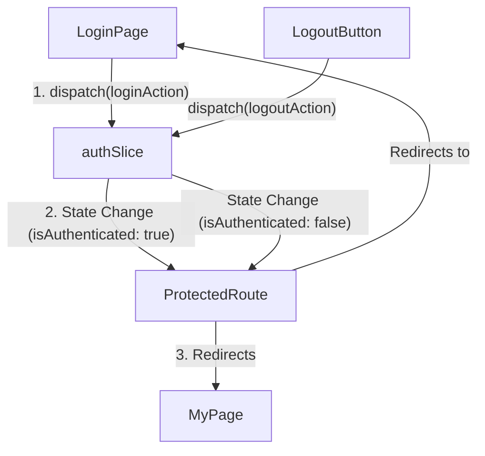
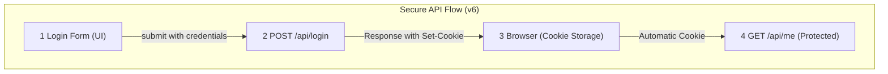

# 모노레포 아키텍처 Auth 시스템, 그리고 Router v7 로의 여정

*[ AI_Todo 프로젝트 개발기 - Frontend #3 ] Auth 시스템 초석 다지기 ( The v6 Era ) & v7 진화 예고*

## 서론: 견고한 토대 위, 첫 번째 기둥을 세우다

지난 2편에서는 순환 참조의 지옥에서 벗어나, 예측 가능하고 확장성 있는 모노레포 아키텍처를 구축하는 여정을 다뤘습니다.    
의존성을 단방향으로 강제하고, CI를 통해 아키텍처의 무결성을 시스템으로 지키는 '견고한 토대'를 마련했습니다.    
이제 이 안정적인 기반 위에 애플리케이션의 핵심 기능인 인증(Authentication) 이라는 첫 번째 기둥을 세울 차례입니다.    

이번 글에서는 **React Router v6** 를 기반으로 어떻게 라우팅, 전역 상태 관리, API 연동을 통해 안전하고 효율적인 초기 인증 시스템을 구축했는지, 그리고 그 과정에서 마주친 기술적 한계들이 어떻게 다음 단계로의 진화를 이끌었는지 심도 있게 공유하고자 합니다.     

> Why Start with v6, not v7?

> v6는 가장 안정적이고 방대한 레퍼런스를 갖춘 '업계 표준'이었습니다.   
> v6의 선언적 API(useEffect, useNavigate 등)에 빠른 MVP(최소 기능 제품) 개발과 핵심 가치 검증이라는 목표에 가장 적합한 선택이라고 생각했습니다.   
> 새로운 패턴의 학습 곡선을 최소화하고, 검증된 안정성 위에서 빠르게 나아가는 것이 당시의 최우선 과제였습니다.

## 1단계. 페이지의 뼈대: 라우팅 구조 확립

인증 시스템 구현의 첫 단추는 사용자가 보게 될 화면들의 경로를 정의하고, 인증 상태에 따라 접근을 제어하는 라우팅 구조를 설계하는 것이었습니다.

### 주요 과정: React Router v6 기반 경로 보호

- **SPA(Single Page Application) 구조 확립:**
	- **react-router-dom v6** 를 도입하여 /, /login, /signup, /mypage 등 핵심 경로와 페이지 컴포넌트를 매핑했습니다.

- **코드 스플리팅:**
	- `React.lazy` 와 `Suspense` 를 활용해 각 페이지를 동적으로 임포트하여 초기 로딩 속도를 개선했습니다.

- **인증 경로 제어:**
	- 별도의 레이아웃 컴포넌트 없이, 인증이 필요한 라우트를 감싸는 `<ProtectedRoute>` 컴포넌트를 구현하여 접근 제어 로직을 중앙화했습니다.

#### 라우터 구도 

### 기술적 결정과 그 이면의 한계

`<ProtectedRoute>`를 통해 인증되지 않은 사용자의 접근을 막는 데는 성공했지만,이 구조의 한계는 명확했습니다.   
인증 로직은 라우터 레벨에 있었지만, 정작 페이지에 필요한 데이터를 가져오고 (fetching), 로딩/에러 상태를 관리하는 책임은 온전히 각 페이지 컴포넌트 내부에 남아 있었습니다.   

이로 인해 여러 페이지에서 유사한 `useEffect` 훅이 중복되기 시작했습니다.

## 2단계. 상태 관리의 중앙화: Redux Toolkit(RTK) 도입

인증 상태는 애플리케이션 전역에서 일관되게 관리되어야 합니다. 이를 위해 **Redux Toolkit(RTK)** 을 도입했습니다.   

### 주요 과정: core/store와 apps/web/store의 역할 분리

- **core/store:**
	- `createSlice` 를 사용하여 인증 관련 상태와 액션을 정의한 `authSlice` 만을 export합니다. 이 슬라이스는 순수 로직 덩어리입니다.

- **apps/web/src/store:**
	- `core/store` 에서 `authSlice` 를 가져와 `configureStore` 를 통해 실제 스토어 인스턴스를 생성하고 `Provider` 로 주입합니다.

이 구조는 core 패키지의 재사용성을 지키는 핵심 결정이었으며, 향후 다른 플랫폼에서도 상태 관리 로직을 재사용할 수 있는 기반이 되었습니다.    

### 기술적 결정과 그 이면의 한계

**RTK** 를 통해 전역 클라이언트 상태는 성공적으로 일원화했지만, 서버 상태(Server State)는 여전히 각 페이지의 `useEffect` 안에서 개별적으로 처리되었습니다.   

로그인 성공 후 사용자 정보를 가져오거나, 페이지 진입 시 필요한 데이터를 불러오는 로직이 컴포넌트의 생명주기에 강하게 결합되어 있어, 데이터 흐름을 추적하고 일관성을 유지하기가 점차 어려워졌습니다.    

## 3단계. 인증 흐름의 구체화: UI와 로직의 결합

설계된 라우팅과 상태 관리 구조 위에서 실제 **로그인/회원가입 UI** 와 **비즈니스 로직**을 구현했습니다.

### 주요 과정: 로그인/로그아웃 플로우 구현

- **UI 구현:**
	- 각 페이지 파일 내에서 `<input>`, `<button>` 태그를 사용하여 로그인/회원가입 폼을 구성했습니다. (초기 단계에서는 core/ui의 공통 컴포넌트를 신경쓰기보다는는 빠른 구현에 집중했습니다.)

- **상태와 라우팅 연동:**
	1. 사용자가 로그인 폼을 제출하면, `onSubmit` 핸들러가 `login` 액션을 `dispatch` 합니다.
	2. `authSlice` 가 상태를 `isAuthenticated: true` 로 변경합니다.
	3. `<ProtectedRoute>`가 상태 변화를 감지하고, 막혔던 페이지로 사용자를 이동시킵니다.

### 이슈와 해결, 그리고 새로운 과제

브라우저의 기본 HTML5 유효성 검사와 React의 상태 기반 유효성 검사가 충돌하는 문제는 `<form noValidate>` 속성으로 해결했습니다.    
하지만 더 근본적인 문제가 드러났습니다.    

폼 제출, API 호출, 로딩 상태 관리, 에러 처리, 성공 시 리다이렉트라는 일련의 로직이 로그인, 회원가입 등 여러 컴포넌트에서 거의 동일하게 반복되었습니다.     
이는 명백한 유지보수성의 저하 신호였습니다.    

## 4단계. 실전 투입: 실제 Auth API 연동

이제 백엔드의 실제 인증 **API(OAuth2 + JWT, HttpOnly 쿠키)** 와 연동할 차례입니다.   
프론트엔드는 토큰을 직접 저장하지 않고, `withCredentials: true` 옵션을 통해 브라우저가 쿠키를 안전하게 처리하도록 위임했습니다.    

### 이슈와 해결, 그리고 새로운 과제

CORS와 withCredentials 관련 이슈는 해결했지만, 모든 API 호출에 대한 로딩 상태와 에러 처리를 각 페이지 컴포넌트에서 `useState` 로 개별 관리하다 보니, 로딩 스피너나 에러 메시지의 UX가 페이지마다 미묘하게 달라지는 비일관성 문제가 발생했습니다.   

## 5단계. 품질 방어선 구축: 테스트와 자동화

새로 구축한 인증 로직의 안정성을 확보하기 위해 테스트 전략을 수립했습니다.

### 주요 과정: 핵심 로직 중심의 테스트

- **authSlice 단위 테스트:**
	- `vitest` 를 사용하여 로그인/로그아웃 액션에 따른 상태 변화를 순수 함수 레벨에서 검증했습니다.
- **ProtectedRoute 통합 테스트:**
	- `@testing-library/react `를 사용해 인증 상태에 따른 리다이렉트 동작을 테스트했습니다.
- **pre-commit 자동화:**
	- `lint-staged,` `madge (순환 참조 검사)` 등으로 코드 품질을 자동으로 방어했습니다.

### 기술적 결정과 그 이면의 한계

핵심 로직은 테스트로 방어할 수 있었지만, 데이터 페칭과 상태 변경, 라우팅이 모두 얽혀있는 실제 페이지 컴포넌트를 테스트하는 것은 점점 더 복잡해졌습니다.   

각 테스트마다 수많은 상태와 컨텍스트를 모의(mocking)해야 했고, 이는 테스트 코드의 가독성과 유지보수성을 떨어뜨리는 원인이 되었습니다.   

## 결론: 성공적인 첫걸음, 그리고 명확해진 다음 과제

**React Router v6** 기반의 인증 시스템은 프로젝트 초기에 빠르고 안정적으로 핵심 기능을 구현하는 데 성공적인 초석이 되어주었습니다.    
하지만 기능이 복잡해짐에 따라, 이 구조의 명확한 한계에 직면하게 되었습니다.   

- 흩어진 데이터 로직: `useEffect` 내에 분산된 서버 상태 관리 로직
- 반복되는 코드: 폼 처리, 로딩/에러 핸들링 로직의 중복
- 불안정한 테스트: 컴포넌트와 비즈니스 로직의 강한 결합으로 인한 테스트의 복잡성 증가

이러한 문제들은 더 이상 방치할 수 없는 기술 부채가 되었고, 자연스럽게 다음 단계로의 진화를 고민하게 되었습니다.    
바로 라우터 레벨에서 데이터 흐름을 통합 관리하는 패러다임으로의 전환입니다.    

다음 글에서는, 이러한 한계를 극복하기 위해 **React Router v7** 의 데이터 라우터(Data Router) 패턴을 도입하여 어떻게 인증 시스템의 구조와 품질을 한 단계 더 끌어올렸는지, 그 치열했던 마이그레이션 과정을 구체적으로 공유하겠습니다.  

> v6와 v7의 차이, 그리고 실전 적용기, 궁금하지 않으신가요?