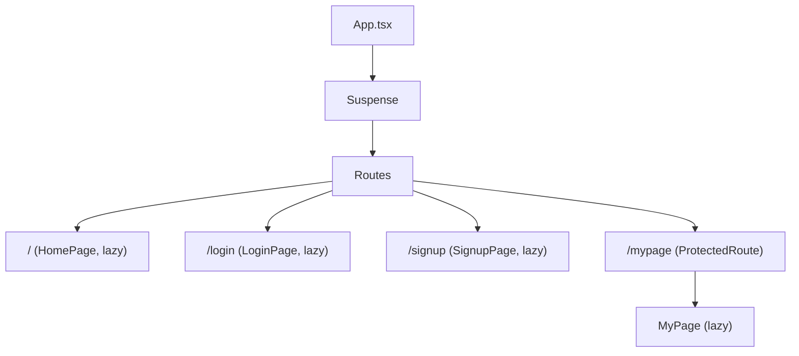
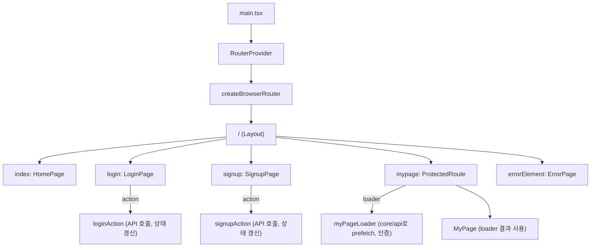
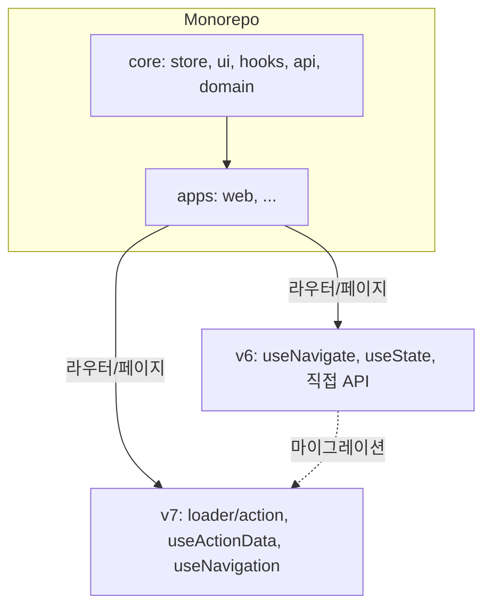

# 모노레포 아키텍처 Auth 시스템의 진화

*[ AI_Todo 프로젝트 개발기 - Frontend #4 ] React Router v7 마이그레이션과 모노레포 아키텍처의 시너지*

## 서론: v6의 한계, 그리고 변화의 필요성

지난 3편에서는 React Router v6 기반으로 인증 시스템을 빠르고 안정적으로 구축한 과정을 다뤘습니다.    

하지만 프로젝트의 페이지/데이터 흐름이 복잡해지면서 v6 구조의 한계가 점점 명확해졌습니다.   

- 데이터 패칭과 라우팅의 분리:
	- 인증/보호 라우트는 `<ProtectedRoute>`로 분기했지만, 실제 데이터 패칭/로딩/에러 처리는 각 페이지 컴포넌트(useEffect)에 흩어져 있었습니다.
- 중첩 레이아웃/라우트의 불편함:
	- 공통 레이아웃(헤더/푸터 등)과 인증/비인증 레이아웃을 계층적으로 관리하기 어렵고, 라우트 선언이 중첩될수록 가독성이 떨어졌습니다.
- 테스트/유지보수의 복잡성:
	- 데이터 흐름, 상태, 라우팅, 에러 핸들링이 분리되어 있어 테스트와 리팩토링이 점점 어려워졌습니다.

## 1. v7로의 마이그레이션: 무엇이 달라졌나?

### 핵심 변화 요약

- 라우터 레벨 데이터 패칭:
	- 각 라우트에 loader, action을 선언해 데이터 패칭/변경/에러 핸들링을 라우터에서 통합 관리
- 중첩 레이아웃/라우트의 자연스러운 설계:
	- Outlet과 중첩 라우트로 공통 레이아웃, 인증/비인증 레이아웃을 계층적으로 설계
- 에러/로딩 UI의 일관성:
	- 라우트 단위로 errorElement, Suspense fallback을 선언해 UX 일관성 및 코드 중복 최소화
- 모노레포 아키텍처와의 시너지:
	- 각 앱(apps/web, apps/mobile 등)은 공통 로직(core/store), UI(core/ui), API(core/api)를 그대로 재사용하면서 라우터 구조만 각 앱에 맞게 선언적으로 조립


## 2. 실제 구조 변화: v6 → v7

### v6 구조 ( web 요약)



- 데이터 패칭/로딩/에러는 각 페이지 컴포넌트 내부에서 처리

### v7 구조 (구체화된 데이터 흐름 포함)




- 각 라우트 노드에 action/loader가 어떻게 연결되는지 명확히 시각화
- 데이터 패칭, 인증, 상태 갱신이 라우터 계층에서 일어남을 강조

## 3. v7의 장점: 모노레포 아키텍처에서의 효과

### 1. 데이터 흐름의 일원화

- loader/action을 통해 데이터 패칭, 인증 체크, 에러/로딩 핸들링을 라우터 계층에서 선언적으로 관리 → 각 페이지 컴포넌트는 UI에만 집중

#### 실제 구조조 예시: mypage 라우트의 loader


#### 1. 단순 데이터 패칭 vs. 라우터 레벨 데이터 패칭의 본질적 차이

- v6 방식
	- HomePage.tsx(혹은 MyPage.tsx)에서 useEffect/useQuery로 직접 API 호출
	- 라우팅과 데이터 패칭이 분리되어 있음
	- 라우트 진입 전 데이터 준비/에러/로딩 제어 불가
	- 인증 실패 시 라우터 레벨에서 redirect 불가(페이지 내부에서만 처리)

- v7 방식
	- loader에서 core/api를 import해 데이터 패칭
	- 라우트 진입 전에 데이터가 준비됨
	- 인증 실패/에러 발생 시 라우터 레벨에서 redirect, errorElement, Suspense 등으로 일관 처리
	- 페이지 컴포넌트는 "데이터가 준비된 상태"에서 UI만 담당
	- 테스트, SSR, Suspense for Data 등과의 연계가 훨씬 자연스러움

#### 2. 구조만 보면 차이가 없어 보일 수 있는 이유

- loader 내부에서 단순히 API만 호출하면, "페이지에서 useEffect로 API 호출"과 코드상 큰 차이가 없어 보임
- 차이는 "언제, 어디서, 어떻게" 데이터가 준비되고, 에러/로딩/리다이렉트가 처리되는가에 있음
- loader는 라우트 진입 전, 라우터 계층에서 동작
- useEffect는 컴포넌트 마운트 후, 컴포넌트 계층에서 동작

#### 3. 실제 차별점이 드러나는 코드 예시 (비교)

 > 페이지 내부 useEffect vs. 라우터 loader+useLoaderData 의 대조

##### v6 (HomePage.tsx)

```ts
// v6: 페이지 내부에서 직접 데이터 패칭
import { useEffect, useState } from 'react';
import { getMyInfo } from 'core/api';

function HomePage() {
  const [user, setUser] = useState(null);
  useEffect(() => {
    getMyInfo().then(setUser);
  }, []);
  // ...로딩/에러/리다이렉트 처리도 여기서 직접
}
```

##### v7 (라우터 계층)

```ts
// v7: 라우터에서 loader로 데이터 패칭
import { getMyInfo } from 'core/api';
import { redirect } from 'react-router-dom';

export async function homePageLoader() {
  try {
    const user = await getMyInfo();
    return user;
  } catch (error) {
    if (isAxiosError(error) && error.response?.status === 401) {
      throw redirect('/login');
    }
    throw error;
  }
}
```

```tsx
// HomePage.tsx: 데이터는 useLoaderData로 바로 사용
import { useLoaderData } from 'react-router-dom';

function HomePage() {
  const user = useLoaderData();
  // UI만 담당, 데이터 패칭/에러/리다이렉트는 라우터에서 이미 처리됨
}
```

#### 4. 정리

- 코드상 import만 보면 차이가 없어 보일 수 있지만,
- 실제 차이는 "데이터 패칭의 위치와 시점, 에러/리다이렉트 처리의 일관성, UI의 단순화"에 있다.
- loader/action 패턴은 "라우터 계층에서 데이터 흐름을 통제"한다는 점에서, useEffect/useQuery와 본질적으로 다르다.
- 이 구조가 모노레포에서 더 빛나는 이유는, core/api 등 공통 모듈을 각 앱의 라우터 계층에서 일관되게 활용할 수 있기 때문

loader에서 core/api를 import하는 코드 자체만 보면 v6와 차이가 없어 보일 수 있지만, "라우터 계층에서 데이터 흐름을 통제하고, UI는 데이터가 준비된 상태만을 가정"  
→ 이 구조적 변화가 진짜 핵심입니다.   

### 2. 중첩 레이아웃/라우트의 유연성

- Layout 컴포넌트와 Outlet을 활용해 공통 UI, 인증/비인증 레이아웃, 다단계 보호 라우트 등 계층적이고 재사용성 높은 구조 설계 가능

### 3. 테스트/유지보수성 향상

- 데이터/상태/라우팅/에러 흐름이 한 곳에 모여 테스트, 리팩토링, 신규 기능 추가가 쉬워짐

### 4. 모노레포 시너지

- core/store, core/ui, core/api 등 공통 패키지는 그대로 재사용
- 각 앱(web, mobile 등)은 자신만의 라우터 구조만 선언적으로 조립
- 앱별로 라우팅/데이터 흐름을 분리하면서도, 공통 로직/컴포넌트는 일관되게 유지

## v7 구조의 시각화 (Monorepo 관점)





## 결론: 변화의 흐름 위에서

React Router v7로의 마이그레이션은 데이터 흐름, 인증, 레이아웃, 에러/로딩 관리를라우터 계층에서 선언적으로 통합함으로써

- 코드 중복 최소화
- 유지보수성/확장성 극대화
- 모노레포 아키텍처에서의 공통 로직 재사용성 강화

라는 효과를 가져왔다고 생각합니다.  
앞으로는 v7의 loader/action, 중첩 라우트, Suspense for Data 등 최신 패턴을 적극적으로 활용해 더 견고하고 유연한 인증 시스템을 만들어갈 예정입니다.

> 물론, loader와 action 함수가 비대해질 경우 이를 어떻게 분리하고 관리할 것인지는 새로운 과제가 될 거라고 생각합니다.
>
> 이를 해결하기 위해서 `loader/action` 의 공통 로직을 헬퍼 함수나 팩토리 패턴으로 추상화하는 전략을 리팩토링 로드맵에 반영했습니다.

> 또한, 새로운 앱이 추가될 때 `core/api`, `core/store` 등 공통 모듈을 그대로 재사용하고, 각 앱의 라우터 구조만 선언적으로 조립하는 구조를 실험하고 있습니다.

> 이런 시스템 설계는 단순히 코드 품질을 넘어서, 팀 전체의 생산성과 사용자 경험(Optimistic UI 등)까지 함께 개선하는 방향임을 강조하고 싶습니다

> 다음 글에서는,
> - loader/action의 공통화/유틸리티화 패턴
> - 앱별 라우터 구조 분리 및 공통 모듈 재사용 사례
> - Optimistic UI 등 UX와 시스템 설계의 연결
> 등, 실제로 확장 가능한 아키텍처를 만들기 위한 구체적 전략과 실험을 공유할 예정입니다.