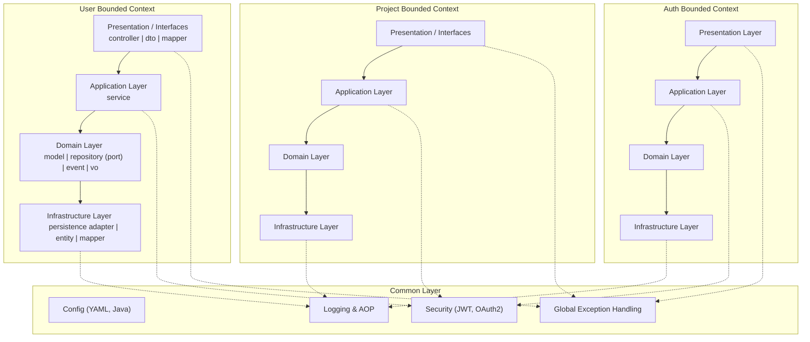

# AI_Todo 프로젝트 백엔드 기록 모음

*[ AI_Todo 프로젝트 개발기 - Backend #0 ] Backend 기록 모음*

> 백엔드를 설계하면서의 기록과정입니다.

1. [[ AI_Todo 프로젝트 개발기 - Backend #1] extends보다 implements를, 그리고 DI를 선택한 이유](https://ramyo564.github.io/git_blog/project_ai_todo/ai_todo_2_b_spring_di/)
2. [[ AI_Todo 프로젝트 개발기 - Backend #2 ] 인증(Auth) 도메인 심층 구현 편](https://ramyo564.github.io/git_blog/project_ai_todo/ai_todo_3_b_spring_auth/)

##  아키텍처 설계

 최종적으로 **MSA(Microservice Architecture)** 전환을 목표로 설계했지만, 현재는 **모놀리식(Monolithic)** 구조로 구성했습니다.    

 ### 모놀리식 구조를 선택한 이유
 
- **트래픽 예측의 어려움:** 서비스 출시 전에는 어느 도메인에 트래픽이 집중될지 예측하기 어렵습니다.
 - **초기 개발 속도 및 성능:** 초기 단계에서는 서비스 간 네트워크 호출로 인한 지연(latency)이 없는 모놀리식 구조가 개발 및 운영 성능 측면에서 더 유리하다고 판단했습니다.

 ### MSA 전환을 고려한 설계

 향후 MSA로 쉽게 전환할 수 있도록, 각 **도메인(Auth, User 등) 간의 결합도를 낮추는 데 집중**했습니다. 각 모듈이 독립적으로 동작할 수 있도록 패키지 구조를 명확히 분리하여 설계했습니다.

### 현재 아키텍처 모습

- Common Layer : 
	- 전역 설정, 보안, 로깅, 예외 처리 등 전 도메인에서 공통으로 사용하는 모듈입니다.
- Bounded Context 별 계층 :
	- 각 컨텍스트(User, Project, Auth)는 헥사고날 아키텍처 원칙에 따라 Presentation/Interfaces (Controller·DTO) → Application(Service) → Domain(모델·포트) → Infrastructure(어댑터) 순으로 의존성이 흐릅니다.
- 의존성 방향
	- 실선(→) : 핵심 비즈니스 흐름
	- 점선(-.-) : 공통 모듈(Common Layer)과의 교차 관심사 의존성
	- 도메인 → 인프라 구조로 단방향이며, 도메인이 인프라 코드를 직접 참조하지 않습니다.

## 다음 단계

> Auth 세부 로직 점검   
> Project VO 점검

> 위의 단계가 완료되면 지속적으로 업데이트 예정