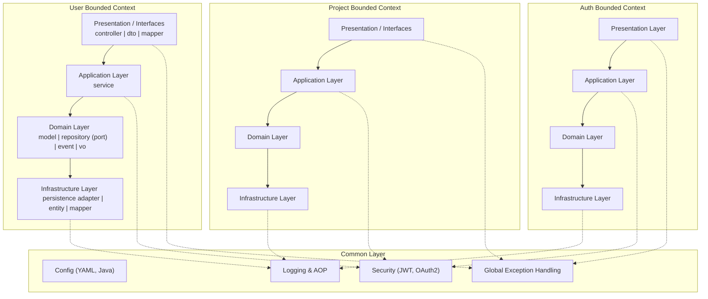

# AI_Todo 프로젝트 백엔드 기록 모음

*[ AI_Todo 프로젝트 개발기 - Backend #0 ] Backend 기록 모음*

> 백엔드를 설계하면서의 기록과정입니다.

1. [[ AI_Todo 프로젝트 개발기 - Backend #1] extends보다 implements를, 그리고 DI를 선택한 이유](https://ramyo564.github.io/git_blog/project_ai_todo/ai_todo_2_b_spring_di/)
2. [[ AI_Todo 프로젝트 개발기 - Backend #2 ] 인증(Auth) 도메인 심층 구현 편](https://ramyo564.github.io/git_blog/project_ai_todo/ai_todo_3_b_spring_auth/)

## 아키텍처 설계

이 프로젝트는 최종적인 **MSA(Microservice Architecture) 전환**을 염두에 두고, 초기에는 단일 서버 **모놀리식(Monolithic)** 구조로 설계되었습니다.   
MSA로의 유연한 전환을 위해 **DDD(도메인 주도 설계)와 헥사고날 아키텍처**를 적용하여 각 도메인의 독립성을 확보하는 데 집중했습니다.    

### 왜 처음부터 모놀리식인가?

- **개발 속도와 초기 성능 확보**: 프로젝트 초기 단계에서는 서비스 간 네트워크 호출로 인한 지연(latency)이 없는 모놀리식 구조가 개발 속도와 운영 성능 측면에서 더 유리하다고 판단했습니다.
- **불확실성 대응**: 서비스 출시 전에는 어느 도메인에 트래픽이 집중될지 예측하기 어렵습니다. 먼저 모놀리식으로 서비스를 운영하며 실제 트래픽을 파악한 후, 부하가 집중되는 특정 도메인부터 MSA로 분리하는 것이 합리적입니다.

### MSA 전환을 고려한 설계

모놀리식 구조의 단점인 도메인 간 높은 결합도를 해결하기 위해, **헥사고날 아키텍처**를 기반으로 각 도메인(`Auth`, `User` 등)이 독립적인 모듈처럼 기능하도록 설계했습니다.    

이러한 설계는 향후 특정 모듈을 그대로 마이크로서비스로 분리할 수 있게 하여, 아키텍처 전환 비용을 최소화하는 기반이 될 수 있다고 생각합니다.

### 현재 아키텍처 모습

- Common Layer : 
	- 전역 설정, 보안, 로깅, 예외 처리 등 전 도메인에서 공통으로 사용하는 모듈입니다.
- Bounded Context 별 계층 :
	- 각 컨텍스트(User, Project, Auth)는 헥사고날 아키텍처 원칙에 따라 Presentation/Interfaces (Controller·DTO) → Application(Service) → Domain(모델·포트) → Infrastructure(어댑터) 순으로 의존성이 흐릅니다.
- 의존성 방향
	- 실선(→) : 핵심 비즈니스 흐름
	- 점선(-.-) : 공통 모듈(Common Layer)과의 교차 관심사 의존성
	- 도메인 → 인프라 구조로 단방향이며, 도메인이 인프라 코드를 직접 참조하지 않습니다.

## 다음 단계

- [x] Spring 
	- [x] DDD & 헥사고날 아키텍처 설계 -> 도메인별로 분리
	- [x] Swagger API 문서 자동화
	- [x] 최소기능 MVP 구현
		- [x] Auth
			- [x] OAuth2 - Google 연동
			- [ ] 기본적인 구성 끝나면 카카오, 네이버 연동하기
			- [x] JWT 설정
			- [x] Session 비활성화
			- [x] Redis 설정하기
		- [x] Project
		- [x] User
	- [x] UUIDv7 변경하기
- [ ] FastAPI 서버 구축
- [ ] Spring 성능 최적화 1차진행
	- [ ] DB 튜닝 
	- [ ] Redis 캐싱
- [ ] rabbitMQ -> 알림 및 타이머등 고도화 진행

> 단계가 완료될 때마다 지속적으로 업데이트 예정