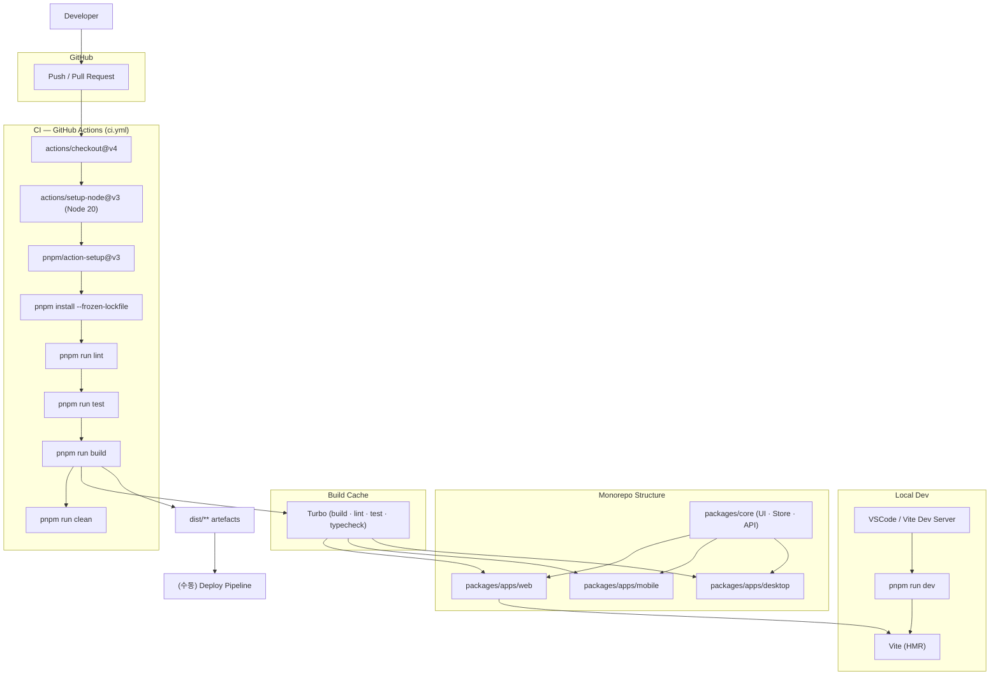
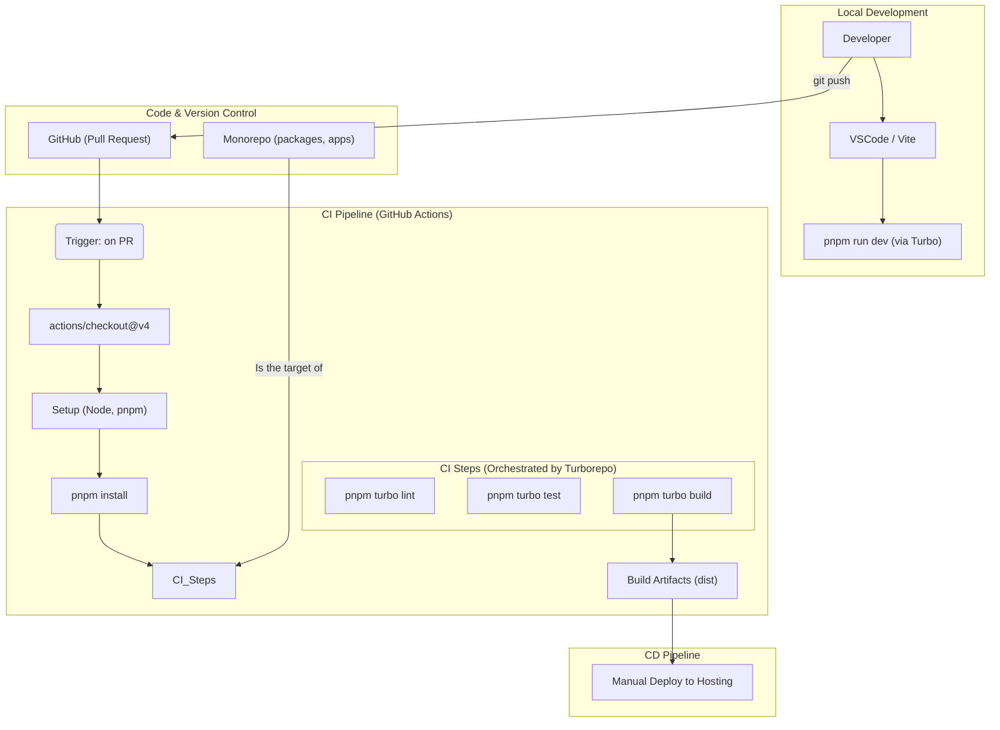

# AI_Todo Dev 기록 모음

*[ AI_Todo 프로젝트 개발기 - DevOps #0 ] Dev 기록 모음*

> DevOps를 설계하면서의 기록과정입니다.

1. [[ AI_Todo 프로젝트 개발기 - DevOps #1 ] JavaScript로 세 마리 토끼 잡는 방법](https://ramyo564.github.io/git_blog/project_ai_todo/ai_todo_1_d_pnpm_turbo/)
2. [[ AI_Todo 프로젝트 개발기 - DevOps #2] ESLint와 Husky로 나만의 품질 파이프라인 구축하기](https://ramyo564.github.io/git_blog/project_ai_todo/ai_todo_2_d_husky_eslint/)
3. [[ AI_Todo 프로젝트 개발기 - DevOps #3] 환경설정 통일 Docker가 아닌 MIse를 선탁한 이유](https://ramyo564.github.io/git_blog/project_ai_todo/ai_todo_3_d_mise/)

## 프론트엔드 DevOps 설계

프론트는 **모노레포(Monorepo)** 아키텍처로 모바일, PC, 웹 등 다양한 플랫폼을 효율적으로 지원하고자 했습니다.   
이런 구조에서 코드품질 및 개발환경, 파이프라인을 구축하기 위해
ESLint, Husky, Mise등을 이용했습니다.

### 프론트엔드 모노레포 내부구조 + 도구 계층

### DevOps 파이프라인 (프론트)

## 다음 단계

- [x] FE 코드 품질 강화 -> ESlint, husky, madge
- [x] FE 빌드 환경 촤적화 -> pnpm, turboRepo
- [x] 개발환경 통일 -> Mise 
- [x] 공유기 보안 및 포트포워딩, DDNS 설정
	- [ ] 외부 제어 X -> VPN으로만 제어
- [x] 미니PC 리눅스 서버 OS 설치
	- [ ] SSH 키 분리
	- [ ] ufw, Fail2ban 설정
	- [ ] WireGuard or OpenVPN 설정 
	- [ ] SSL/TLS 인증서 관리 자동화
	- [ ] SSH 포트 닫기 및 VPN 으로 SSH 연결
- [ ] 모니터링 환경 구축
- [ ] 부하테스트 환경 구축
- [ ] 도커 환경 분리
- [ ] CI/CD 구축 (gitActions 로컬 구축 with webhook)
- [ ] Nginx 적용
- [ ] 무중단 배포 구현(Blue-Green or Canary 스타일)
- [ ] Spring Cloud 검토해보기
- [ ] Kubernetes (필요하다고 판단 되면)

> 단계가 완료될 때마다 지속적으로 업데이트 예정