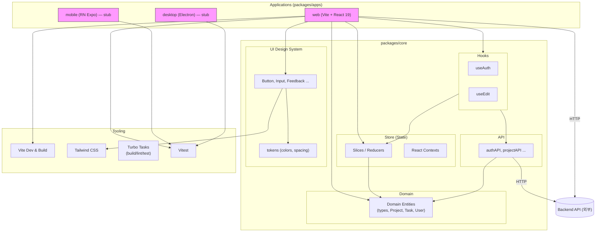

# AI_Todo 프로젝트 프론트 기록 모음

*[ AI_Todo 프로젝트 개발기 - Frontend #0 ] Frontend 기록 모음*

> 프론트엔드를 설계하면서의 기록과정입니다.

1. [[ AI_Todo 프로젝트 개발기 - Frontend #1 ] 모놀로프로 아키텍처 리팩토링을 선택한 이유](https://ramyo564.github.io/git_blog/project_ai_todo/ai_todo_2_f_react_architecture_1/)
2. [[ AI_Todo 프로젝트 개발기 - Frontend #2 ] 모노레포 쉽지 않네](https://ramyo564.github.io/git_blog/project_ai_todo/ai_todo_3_f_react_architecture_2/)
3. [[ AI_Todo 프로젝트 개발기 - Frontend #3 ] Auth 시스템 초석 다지기 ( The v6 Era ) & v7 진화 예고](https://ramyo564.github.io/git_blog/project_ai_todo/ai_todo_4_f_react_auth_1/)
4. [[ AI_Todo 프로젝트 개발기 - Frontend #4 ] React Router v7 마이그레이션과 모노레포 아키텍처의 시너지](https://ramyo564.github.io/git_blog/project_ai_todo/ai_todo_5_f_react_auth_2/)

## 프론트엔드 DevOps 설계

프론트는 **모노레포(Monorepo)** 아키텍처로 모바일, PC, 웹 등 다양한 플랫폼을 효율적으로 지원하고자 했습니다.

### 모노레포를 선택한 이유

- **크로스 플랫폼 개발 용이성:** TypeScript 기반의 단일 코드베이스로 여러 플랫폼(모바일, 웹, PC)에 일관된 기능을 제공하고 안정성을 높일 수 있습니다.
- **개발 리소스 절감 및 유지보수 효율화:** 공통 로직, 타입, 유틸리티 등을 공유하여 중복 코드를 줄이고, 기능별 모듈화를 통해 유지보수 비용을 최소화합니다.
- **확장성 확보:** 향후 새로운 플랫폼이 추가되더라도 기존의 코드베이스와 구조를 재활용하여 유연하고 빠르게 확장할 수 있습니다.

### 현재 아키텍처 모습

