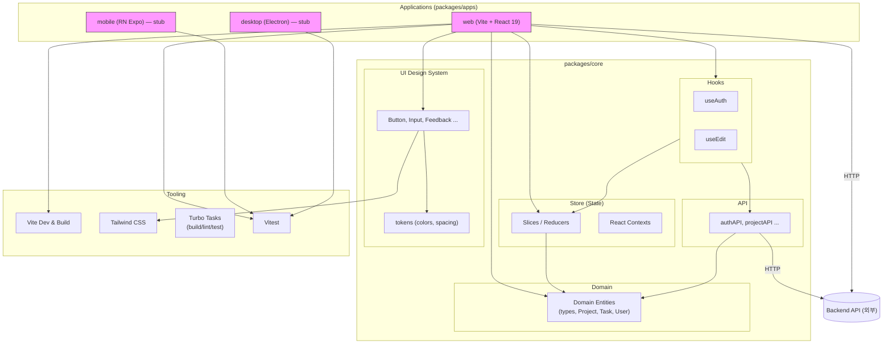
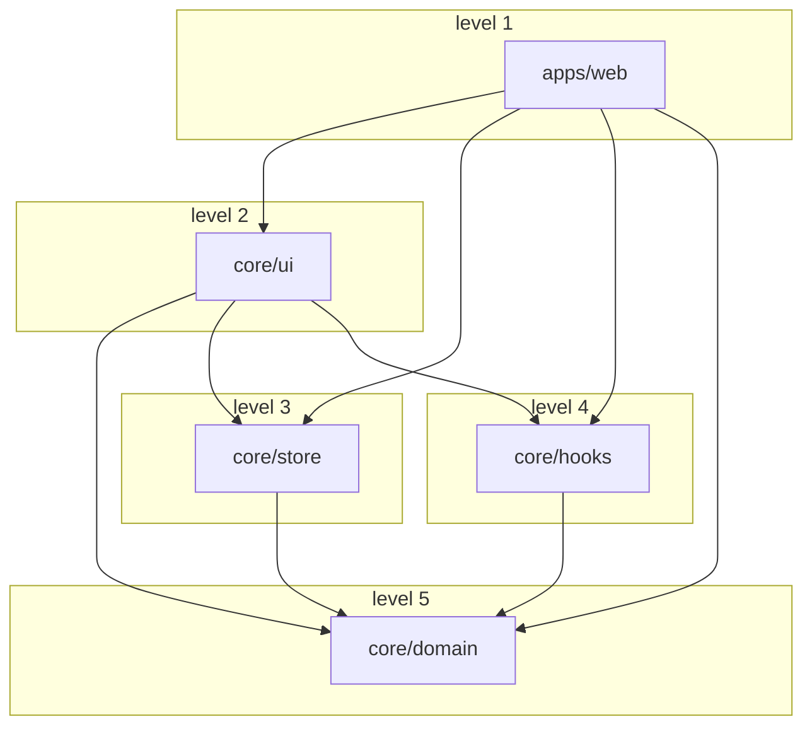
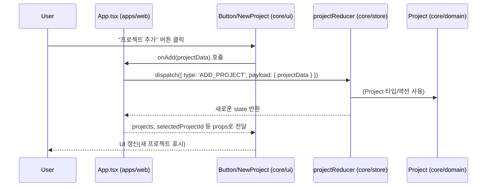
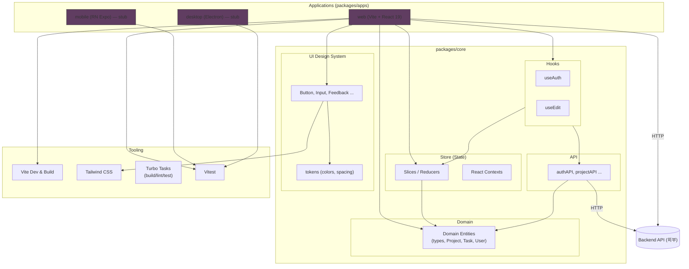
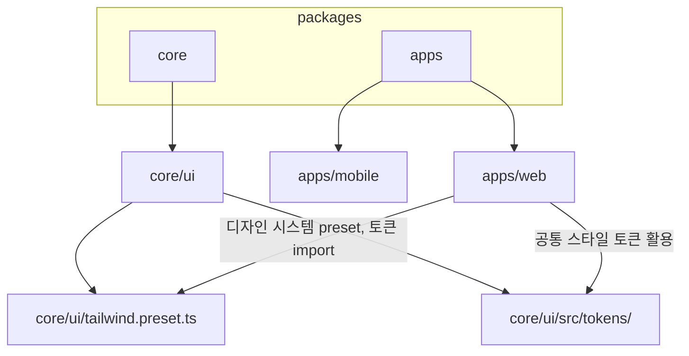
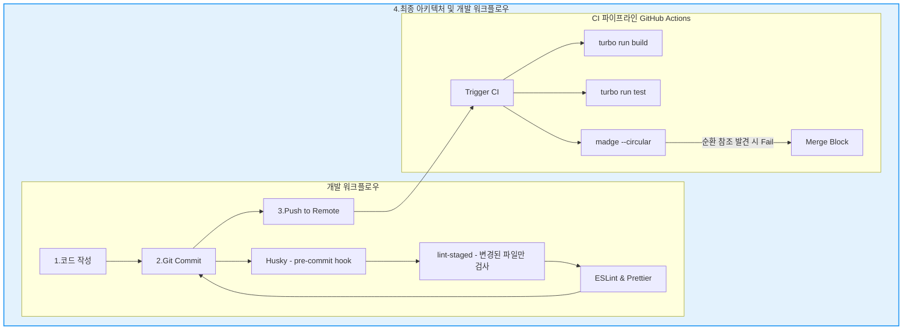

# AI_Todo 프로젝트 프론트 기록 모음

*[ AI_Todo 프로젝트 개발기 - Frontend #0 ] Frontend 기록 모음*

> 프론트엔드를 설계하면서의 기록과정입니다.

1. [[ AI_Todo 프로젝트 개발기 - Frontend #1 ] 모놀로프로 아키텍처 리팩토링을 선택한 이유](https://ramyo564.github.io/git_blog/project_ai_todo/ai_todo_2_f_react_architecture_1/)
2. [[ AI_Todo 프로젝트 개발기 - Frontend #2 ] 모노레포 쉽지 않네](https://ramyo564.github.io/git_blog/project_ai_todo/ai_todo_3_f_react_architecture_2/)
3. [[ AI_Todo 프로젝트 개발기 - Frontend #3 ] Auth 시스템 초석 다지기 ( The v6 Era ) & v7 진화 예고](https://ramyo564.github.io/git_blog/project_ai_todo/ai_todo_4_f_react_auth_1/)
4. [[ AI_Todo 프로젝트 개발기 - Frontend #4 ] React Router v7 마이그레이션과 모노레포 아키텍처의 시너지](https://ramyo564.github.io/git_blog/project_ai_todo/ai_todo_5_f_react_auth_2/)

## 프론트엔드 DevOps 설계

프론트는 **모노레포(Monorepo)** 아키텍처로 모바일, PC, 웹 등 다양한 플랫폼을 최소 비용으로 구축하는걸 목표로 하고 있습니다.   

### 모노레포를 선택한 이유

- **크로스 플랫폼 개발 용이성:** TypeScript 기반의 단일 코드베이스로 여러 플랫폼(모바일, 웹, PC)에 일관된 기능을 제공하고 안정성을 높일 수 있습니다.
- **개발 리소스 절감 및 유지보수 효율화:** 공통 로직, 타입, 유틸리티 등을 공유하여 중복 코드를 줄이고, 기능별 모듈화를 통해 유지보수 비용을 최소화합니다.
- **확장성 확보:** 향후 새로운 플랫폼이 추가되더라도 기존의 코드베이스와 구조를 재활용하여 유연하고 빠르게 확장할 수 있습니다.

### 1. 현재 아키텍처 모습

#### 예 : web app의 흐름도

- core 에서 의존방향 규칙을 준수한다면 web이든 mobile 이든 어떻게 사용하든 상관이 없다.

### 2. 데이터/액션 흐름

### 3. 각 앱의 공유 라이브러리 의존 관계 (예 : tailwindCSS)

### 4. 코드품질 자동화 시스템 아키텍처

## 다음 단계

- [x] React 
	- [x] 모노레포 아키텍처 구조로 재설계
	- [x] 빌드환경 리팩토링 npm -> pnpm & turborepo 적용
	- [x] 개발환경 표준화 docker -> mise 적용
	- [x] CSS -> tailwindcss 적용
	- [x] 코드품질 개선 -> madge, ESlint, husky 적용
	- [x] 최소기능 MVP 구현
	- [x] OAuth2 구글 로그인 연동 및 백엔드 연결
	- [x] 사용자 보안 강화 -> JWT + HttpOnly 쿠기 
	- [x] react-router-dom v6 -> v7 리팩토링
	- [x] Core 및 전역 상태관리 -> Redux 적용
	- [ ] Nest.JS (필요시)
- [ ] RN
- [ ] Electron

> 단계가 완료될 때마다 지속적으로 업데이트 예정