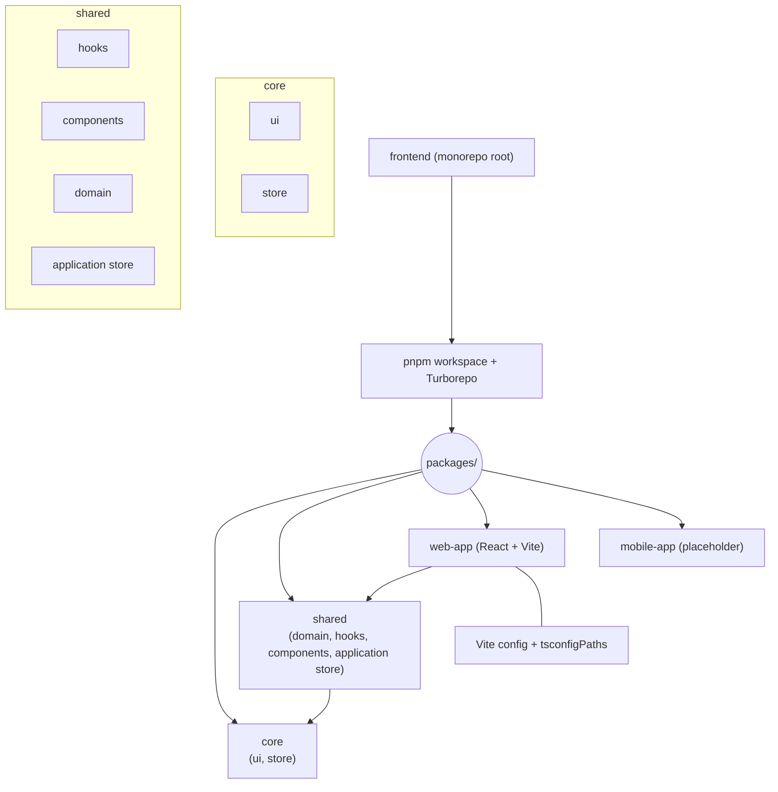
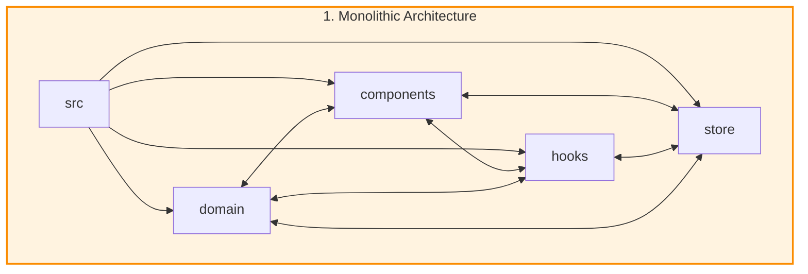
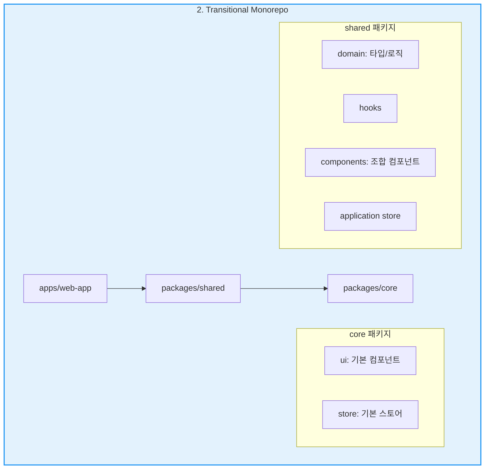
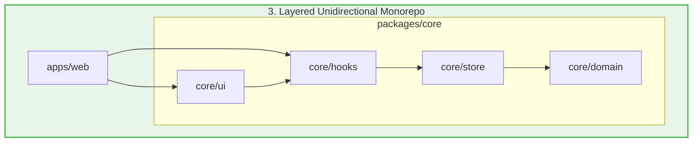
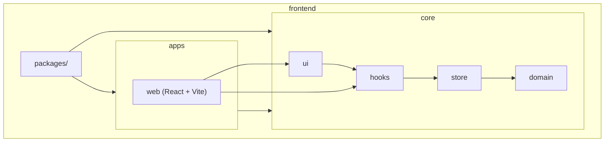
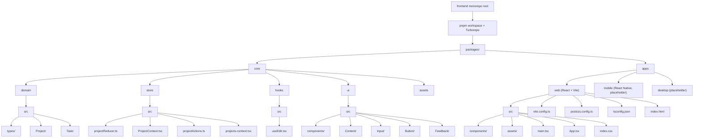
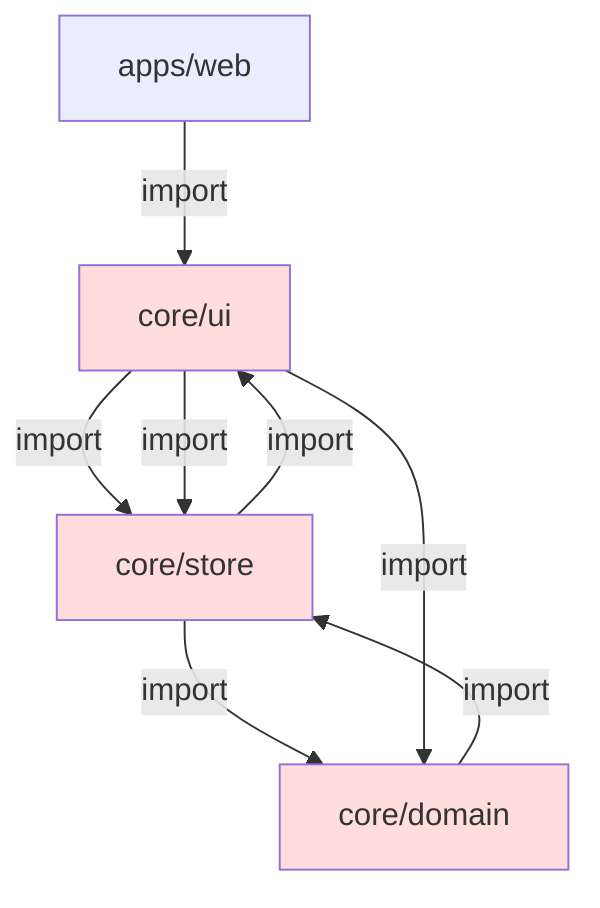
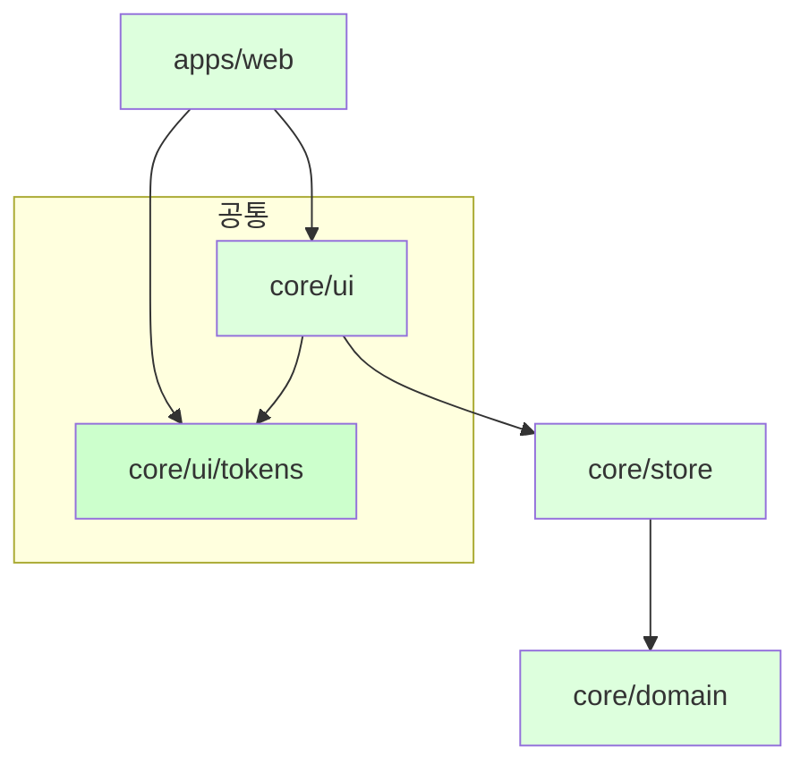
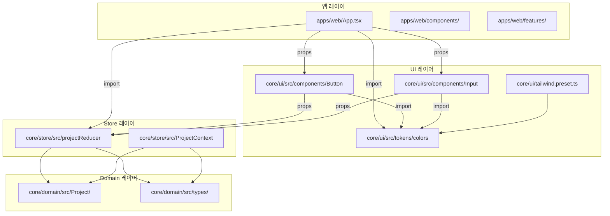
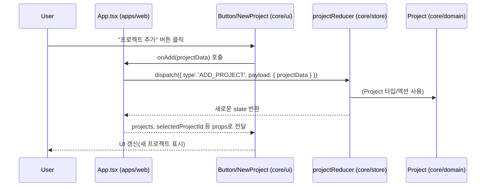

# 테스트




### 1단계: 기존 CRA (모놀리식) 아키텍처

개념: 모든 코드(UI, 로직, 상태, 타입 등)가 단일 src 폴더 내에 공존하는 전통적인 Create React App 구조입니다.

구조 및 의존성 그래프:



장점:

- 구조의 단순성: 모든 파일이 한 곳에 있어 이해하고 참조하기가 매우 쉽습니다.

- 빠른 개발 속도: 소규모 프로젝트나 프로토타입 제작에 매우 효율적입니다.

단점:

- 강한 결합과 순환 참조: 이것이 가장 큰 문제였습니다. 모든 요소가 서로를 자유롭게 import할 수 있어, 코드 베이스 전체에 걸쳐 복잡하고 예측 불가능한 의존성이 형성되었습니다. 결국 이것이 수많은 순환 참조 에러의 직접적인 원인이었습니다.

- 재사용 및 확장 불가: 코드를 분리하여 다른 프로젝트에서 사용하는 것이 거의 불가능하며, 프로젝트 규모가 커질수록 유지보수 비용이 기하급수적으로 증가합니다.

<br/>

---

### 2단계: 과도기 모노레포 (계층 혼재)

개념: 사용자께서 정확히 설명해주신 대로, 코드를 web-app, shared, core 등으로 나누어 계층을 만들려고 시도했던 구조입니다.

구조 및 의존성 그래프:



장점:

- 관심사 분리 시도: core(저수준)와 shared(고수준)라는 계층을 만들려는 시도 자체는 올바른 방향이었습니다.

- 패키지화: 코드를 재사용 가능한 단위로 묶으려는 첫걸음을 떼었습니다.

단점:

- shared 패키지의 역할 과부하: 이 구조의 결정적인 실패 원인입니다. shared 패키지는 domain, hooks, components, store 등 너무 많은 역할을 한 번에 수행하는 제2의 모놀리식이 되었습니다.

- 숨겨진 순환 참조 발생: 여기서 우리가 겪었던 순환 참조가 발생했습니다.

1. shared/components는 core/ui의 기본 컴포넌트를 사용합니다. (shared → core)

2. 그런데 core/ui의 기본 컴포넌트가 shared/domain에 정의된 특정 type을 필요로 하는 경우가 생깁니다. (core → shared)

3. 결과적으로 shared ↔ core 라는 거대한 순환 참조가 발생하여 빌드 시스템 전체를 마비시켰습니다.

- 모호한 경계: core/store와 shared/application store의 역할이 무엇이 다른지, core/ui와 shared/components의 경계가 어디인지 모호하여 혼란을 야기했습니다.

<br/>

---

### 3단계: 현재 아키텍처 (엄격한 단방향 계층)

개념: shared라는 모호한 패키지를 완전히 해체하고, 모든 공유 코드를 역할에 따라 명확하게 분리된 core/* 패키지로 재편성했습니다. 의존성은 오직 한 방향으로만 흐릅니다.

구조 및 의존성 그래프:


장점:

- 순환 참조 원천 봉쇄: domain ← store ← hooks ← ui 로 흐르는 엄격한 단방향 의존성은 순환 참조가 발생하는 것을 아키텍처 수준에서 불가능하게 만듭니다.

- 명확한 역할과 책임:

- domain: 순수 데이터와 타입. 의존성 없음.

- store: 상태 관리 로직. domain에만 의존.

- hooks: 상태를 사용하는 로직. store에만 의존.

- ui: 순수 UI. hooks를 통해 상태를 주입받음.

- apps: 이 모든 것을 조합하여 사용자에게 제공.

- 최고 수준의 재사용성과 테스트 용이성: 각 패키지가 작고 책임이 명확하여 독립적으로 테스트하고 다른 앱에서 재사용하기가 매우 용이합니다.

- AI 협업 효율 극대화: AI가 특정 패키지의 역할(e.g., "domain은 순수해야 한다")을 명확히 인지할 수 있어, 더 정확하고 규칙에 맞는 코드를 생성할 수 있습니다.

단점:

- 초기 설정의 복잡성: 1, 2단계에 비해 패키지 수가 늘어나 초기 설정과 빌드 구성이 다소 복잡하게 느껴질 수 있습니다. 하지만 이 복잡성은 장기적인 안정성을 위한 투자입니다.


## 현재 아키텍처 분석

### 1. 최상위 구조

- frontend (monorepo root)

- package.json, pnpm-workspace.yaml, turbo.json 등 모노레포 관리 파일

- packages/

- core/

- domain/ (비즈니스 로직, 타입, 순수 함수)

- store/ (상태 관리, 비즈니스 로직)

- hooks/ (공통 커스텀 훅)

- ui/ (순수 프레젠테이셔널 컴포넌트)

- apps/

- web/ (React + Vite 기반 실제 앱)

- (향후) mobile/, desktop/ 등 추가 가능

### 2. 의존성 계층

- 단방향 의존성

- apps/web → core/ui, core/hooks

- core/ui → core/hooks (UI에서 상태/로직이 필요할 때)

- core/hooks → core/store

- core/store → core/domain

- core/domain (의존성 없음, 완전한 순수 계층)

### 3. 각 패키지의 역할

- core/domain: 타입, 비즈니스 로직, 데이터 모델. 어떤 UI/상태 관리에도 의존하지 않음.

- core/store: 전역 상태 관리, 비즈니스 로직. 오직 domain만 참조.

- core/hooks: 재사용 가능한 커스텀 훅. 오직 store만 참조.

- core/ui: Dumb(프레젠테이셔널) 컴포넌트. 오직 hooks만 참조.

- apps/web: 실제 앱. 모든 core 패키지를 조합하여 사용자 경험을 만듦.

---

## 현재 아키텍처의 Mermaid 다이어그램






## 분석 및 장단점

### 장점

- 실제 폴더 구조와 1:1 매핑:

- 각 패키지와 내부 폴더가 실제로 존재하는 구조와 정확히 일치합니다.

- 관심사 분리:

- domain, store, hooks, ui가 명확히 분리되어 있고, 각 폴더 내부도 역할별로 잘 나뉘어 있습니다.

- 확장성:

- apps 폴더에 web, mobile, desktop 등 다양한 앱을 추가할 수 있습니다.

- 설정 파일의 명확한 위치:

- 각 앱의 빌드/스타일/타입 설정 파일이 앱 폴더 내에 위치.

### 단점

- 초기 진입 장벽:

- 폴더가 많고, 각 계층의 역할을 이해하는 데 시간이 걸릴 수 있습니다.

- 상용구 코드 증가:

- 계층 분리를 위해 작은 기능도 별도 파일/폴더로 분리해야 하는 경우가 많음.

- 규칙 미준수 시 구조 붕괴 위험:

- 단방향 의존성, 경로 alias, peerDependencies 등 규칙을 어기면 구조가 쉽게 무너질 수 있음.

---

이 다이어그램은 실제 /packages 폴더 구조와 의존성 흐름을 최대한 반영한 것입니다.

더 세부적인 계층(예: 각 컴포넌트 폴더 내부 구조 등)이나, 특정 앱/패키지의 상세 구조가 필요하시면 언제든 말씀해 주세요!


## 의존성


래는 실제 /packages 폴더 구조와 의존성 흐름을 반영한 Mermaid 다이어그램입니다.

---

현재 아키텍처 구조 (Mermaid):

- core, apps, 각 내부 폴더 및 주요 파일까지 시각화

- 실제 폴더/파일명 기반

다이어그램이 정상적으로 렌더링되어야 하며,

더 세부적인 계층이나 특정 패키지의 상세 구조가 필요하시면 언제든 말씀해 주세요!

근데 그럼 해당 아키텍처를 순환구조가 안되게 사용하려면 어떤 식으로 써야되는거야?

아주 중요한 질문입니다!

현재의 계층형 모노레포 아키텍처에서 순환 참조(circular dependency)가 발생하지 않게 하려면,

아래와 같은 “단방향 의존성 규칙”과 “코드 작성 습관”을 반드시 지켜야 합니다.

---

## 1. 단방향 의존성 계층을 엄격히 준수

### 의존성 흐름 예시

text

Apply to index.css

apps/web

   ↓

core/ui

   ↓

core/hooks

   ↓

core/store

   ↓

core/domain

- 절대 금지:

- core/domain이 core/store나 core/ui를 import

- core/store가 core/hooks나 core/ui를 import

- core/ui가 apps/web을 import

- apps/web이 core/domain을 직접 import(허용할 수도 있지만, 보통은 store/hook/ui를 통해서만 접근)

---

## 2. 각 계층의 “책임”을 명확히 분리

- core/domain:

- 타입, 비즈니스 로직, 데이터 모델만 정의

- React, 상태관리, UI 등 어떤 것도 import하지 않음

- core/store:

- 상태 관리, 비즈니스 로직

- 오직 core/domain만 import

- core/hooks:

- 재사용 가능한 커스텀 훅

- 오직 core/store만 import

- core/ui:

- Dumb(프레젠테이셔널) 컴포넌트

- 오직 core/hooks만 import

- apps/web:

- 실제 앱, 모든 core 패키지를 조합

- core 패키지의 public API만 import

---

## 3. 코드 작성 시 체크리스트

- import 경로를 항상 점검:

- 상대경로(../../store) 대신 반드시 alias(@core/store) 사용

- import가 “아래 계층”만 향하는지 항상 확인

- 타입/함수/컴포넌트 export 위치 주의:

- 예) core/domain의 타입을 core/ui에서 직접 import하면 안 됨

- 필요한 타입은 core/store에서 받아서 전달

- 공통 유틸리티/타입은 “최하위 계층”에만 위치

- 테스트 코드도 계층 규칙을 따라야 함

---

## 4. 자동화 도구 활용

- ESLint 플러그인(import/no-cycle):

- 순환 참조가 발생하면 빌드/커밋을 막도록 설정

- madge, dependency-cruiser 등:

- pnpm exec madge --circular --extensions ts,tsx packages

- CI에서 순환 참조가 발견되면 PR을 막음

---

## 5. 예시 (잘못된 코드와 올바른 코드)

❌ 잘못된 예시 (순환 참조 발생)

ts

Apply to index.css

// core/domain/Project.ts

import { useProjectStore } from '@core/store'; // 금지!

// core/ui/ProjectList.tsx

import { ProjectType } from '@core/domain'; // (가능하지만, store를 통해 전달받는 것이 더 안전)

✅ 올바른 예시

ts

Apply to index.css

// core/domain/Project.ts

export type ProjectType = { ... }; // 순수 타입만

// core/store/projectStore.ts

import { ProjectType } from '@core/domain/Project';

// core/hooks/useProject.ts

import { useProjectStore } from '@core/store/projectStore';

// core/ui/ProjectList.tsx

import { useProject } from '@core/hooks/useProject';

---

## 요약

- 항상 “아래 계층”만 import

- 타입/함수/컴포넌트 export 위치를 계층 규칙에 맞게 유지

- 자동화 도구로 순환 참조를 강제 차단

- 코드 리뷰 시 import 경로와 계층 규칙을 반드시 체크

이 규칙만 지키면, 현재 아키텍처에서는 순환 참조가 원천적으로 불가능해집니다!

추가로, 실제 코드 예시나 madge/ESLint 설정법이 필요하시면 언제든 말씀해 주세요.

그럼 web에서는 core 를 마음데로 갔다 써도 순환구조가 안일어나?

아주 좋은 질문입니다!

결론부터 말씀드리면, web(apps/web)에서 core의 여러 계층(ui, hooks, store, domain 등)을 “마음대로” import해도, core 내부의 계층 규칙만 잘 지키면 순환 참조는 발생하지 않습니다.

---

## 왜 그런가?

### 1. apps/web은 “최상위 소비자” 계층

- apps/web은 core의 모든 계층(ui, hooks, store, domain 등)을 읽기만 하고, core 내부에서 web을 import하는 일은 없습니다.

- 즉, web → core 방향의 단방향 의존성만 존재합니다.

### 2. core 내부 계층만 단방향이면 됨

- 순환 참조는 core 내부에서 아래 계층이 위 계층을 import할 때 발생합니다.

- 예: core/domain이 core/store를 import → 순환 참조 발생

- 예: core/ui가 core/store와 서로 import → 순환 참조 발생

- 하지만 web이 core의 여러 계층을 동시에 import하는 것은, core 내부 계층 간의 의존성에는 아무런 영향을 주지 않습니다.

---

## 예시

ts

Apply to index.css

// apps/web/src/App.tsx

import { Button } from '@core/ui';

import { useProject } from '@core/hooks';

import { projectReducer } from '@core/store';

import { ProjectType } from '@core/domain';

- 위와 같이 web에서 core의 여러 계층을 동시에 import해도,

core 내부에서 아래 계층이 위 계층을 import하지 않는 한 순환 참조는 발생하지 않습니다.

---

## 단, 주의할 점

- core 내부 계층 규칙을 반드시 지켜야 함

- 예: core/ui가 core/store를 import하면 안 됨

- 예: core/domain이 core/ui를 import하면 안 됨

- web에서 core를 import하는 것은 “소비”만 하므로 안전

- core가 web을 import하는 순간, 순환 참조가 발생할 수 있음 (이건 절대 금지!)

---

## 요약

- web(apps/web)은 core의 모든 계층을 자유롭게 import해도 순환 참조가 발생하지 않는다.

- 순환 참조는 core 내부 계층 간의 잘못된 import에서만 발생한다.

- core 내부 계층 규칙(단방향성)만 잘 지키면, web에서의 자유로운 import는 안전하다.

추가로, 실제 madge 등으로 순환 참조를 체크하는 방법이나, 더 복잡한 예시가 필요하시면 말씀해 주세요!


## 대규모 리팩토링 정리

### 1. 이전 아키텍처(리팩토링 전) 분석

#### 구조적 특징

- core/ui: 도메인별(예: Project, Task) 폴더에 UI 컴포넌트가 분산, 일부는 상태/스토어/훅에 직접 의존

- core/store: 상태 관리와 도메인 로직이 혼재, 일부 UI/비즈니스 로직이 섞여 있음

- core/domain: 타입/도메인 로직이지만, UI/Store 코드가 일부 혼입

- 공통 이미지/토큰/스타일 시스템 없음

- 앱별(예: web) 구조: Smart/Presentational 분리가 불명확, 상태/로직/프레젠테이션이 혼재

#### 의존성 흐름

- UI → Store/Domain, Store ↔ Domain, UI ↔ Store 등 양방향/순환 의존 가능성

- 디자인 토큰/스타일 시스템이 없어 tailwind 클래스, 인라인 스타일, 하드코딩 색상 등이 혼재

---

### 2. 현재(리팩토링 후) 아키텍처 분석

#### 최신 폴더 구조


```text
packages/
├── core/
│   ├── domain/   # 순수 타입/도메인 로직만 (UI/Store 코드 없음)
│   │   └── src/
│   │       ├── types/
│   │       ├── Project/
│   │       └── Task/
│   ├── store/    # 상태 관리(리듀서, 컨텍스트 등), domain만 참조
│   │   └── src/
│   │       ├── ProjectContext.tsx
│   │       ├── projectReducer.ts
│   │       ├── projectActions.ts
│   │       └── ...
│   ├── hooks/    # (확장 가능, 현재 비어있거나 최소화)
│   ├── ui/       # Dumb UI 컴포넌트, 디자인 토큰, 스타일 시스템
│   │   ├── src/
│   │   │   ├── tokens/   # colors, spacing, typography, border 등 디자인 토큰
│   │   │   ├── components/
│   │   │   │   ├── data-display/
│   │   │   │   ├── feedback/
│   │   │   │   ├── layout/
│   │   │   │   └── ...
│   │   │   ├── Input/
│   │   │   ├── Button/
│   │   │   └── ...
│   │   └── tailwind.preset.ts
│   └── assets/   # 공통 이미지 등
├── apps/
│   ├── web/
│   │   └── src/
│   │       ├── components/
│   │       │   ├── project/
│   │       │   └── task/
│   │       ├── App.tsx
│   │       └── ...
│   ├── mobile/
│   └── desktop/
```

#### 의존성/흐름

- 단방향 계층 구조

apps → core/ui → core/store → core/domain

- UI는 오직 props로만 데이터/핸들러를 주입받음

(store/hook/domain 직접 참조 금지)

- 디자인 토큰/스타일 시스템

모든 플랫폼에서 공통 토큰 import, tailwind + 토큰 병행

- Smart/Presentational 분리

앱 레이어에서 상태/로직 관리, core/ui는 Dumb 컴포넌트만

---

## 3. 아키텍처 변화 요약 (비교)

|구분|리팩토링 전(이전)|리팩토링 후(현재)|
|---|---|---|
|UI 구조|도메인별/상태 혼재, 의존성 복잡|기능별, Dumb 컴포넌트, 단방향|
|상태 관리|UI ↔ Store ↔ Domain 순환 가능|Store → Domain 단방향|
|디자인 토큰|없음, 하드코딩/클래스 혼재|tokens 폴더, tailwind + 토큰 병행|
|의존성|양방향/순환 가능|계층별 단방향, 순환 금지|
|확장성/유지보수|낮음|높음, 멀티플랫폼 대응 용이|

---

## 4. Mermaid Graph (graph TD)

### 이전 구조 (리팩토링 전)



### 현재 구조 (리팩토링 후)



### 정리

- 이전 구조: 순환/양방향 의존, 도메인별/상태/프레젠테이션 혼재, 확장성/유지보수 낮음

- 현재 구조: 단방향 계층, 공통 토큰/스타일 시스템, Smart/Presentational 분리, 멀티플랫폼 확장성/유지보수 극대화


아주 좋은 요청입니다!

최신 구조 기준으로 계층별 흐름과 각 레이어별 역할을

실무에서 바로 참고할 수 있도록 구체적으로 정리해드리겠습니다.

---

## 1. 전체 계층 구조 및 흐름

```
apps/
  ├── web/
  ├── mobile/
  └── desktop/
core/
  ├── ui/
  ├── store/
  ├── hooks/
  └── domain/
```

### 의존성 흐름

```text
apps/*  →  core/ui  →  core/store  →  core/domain
```

- 오직 단방향 (역방향/순환 금지)

- 공통 디자인 토큰은 core/ui/tokens에서 모든 레이어가 import 가능

## 2. 각 레이어별 역할

### 1) apps/\* (web, mobile, desktop 등)

- 역할:

- 실제 사용자에게 배포되는 앱(웹, 모바일, 데스크탑)

- 상태/비즈니스 로직 관리(Smart/Container)

- 라우팅, 페이지, 앱 전용 컴포넌트, 앱별 스타일/설정

- 예시:

- App.tsx, main.tsx, /components/, /features/, /pages/

- useReducer, useState, useEffect 등으로 상태 관리

- core/ui의 Dumb 컴포넌트에 props로 데이터/핸들러 전달

---

### 2) core/ui

- 역할:

- Dumb(프레젠테이셔널) 컴포넌트 집합 (상태/스토어/훅 직접 참조 금지)

- 디자인 토큰, 스타일 시스템(tailwind.preset.ts) 제공

- 플랫폼별 구현 분리(웹: .tsx, RN: .native.tsx)

- 예시:

- /src/components/ (Button, Input, Placeholder, Sidebar 등)

- /src/tokens/ (colors, spacing, typography, border 등)

- tailwind + 토큰 기반 스타일 병행

---

### 3) core/store

- 역할:

- 상태 관리(리듀서, 컨텍스트, 액션 등)

- 비즈니스 로직, 상태 전이, 도메인만 참조(React/Store 코드만)

- 앱/컴포넌트에 상태/핸들러를 props로 전달

- 예시:

- projectReducer.ts, ProjectContext.tsx, projectActions.ts

- Redux Toolkit, Zustand, Context API 등 확장 가능

---

### 4) core/domain

- 역할:

- 순수 타입/도메인 로직만 (UI/Store/React 코드 없음)

- 비즈니스 엔티티, 타입, 인터페이스, enum 등 정의

- 예시:

- /src/types/, /src/Project/, /src/Task/

- Project, Task, ProjectsState, ProjectAction 등

---

### 5) core/hooks (선택적)

- 역할:

- 공통 커스텀 훅(로직 재사용)

- 예: useEdit, useModal 등

- 예시:

- useEdit.ts, useModal.ts

---

### 6) core/assets

- 역할:

- 공통 이미지, 아이콘 등 정적 자산

- 빌드시 각 앱의 public/assets로 자동 복사

---

## 3. 구체적 계층별 흐름 예시

### 1. 앱 레이어 (apps/web)

- App.tsx에서 useReducer로 상태 관리

- 상태/핸들러를 core/ui 컴포넌트에 props로 전달

- 라우팅, 페이지, 앱 전용 컴포넌트 관리

### 2. UI 레이어 (core/ui)

- Button, Input, Placeholder 등은 오직 props로만 동작

- 디자인 토큰 import, tailwind + 토큰 기반 스타일 병행

- 플랫폼별 구현 분리(.tsx, .native.tsx)

### 3. Store 레이어 (core/store)

- projectReducer, ProjectContext 등에서 상태/비즈니스 로직 관리

- 도메인 타입만 참조, UI/훅 직접 참조 금지

### 4. Domain 레이어 (core/domain)

- Project, Task 등 엔티티/타입/enum만 정의

- 어떤 UI/Store 코드도 포함하지 않음

---

## 4. Mermaid 그래프 (상세 계층 흐름)




## 5. 실무적 요약

- 앱 레이어: 상태/로직/라우팅/페이지, Smart 컴포넌트, core/* 의존

- UI 레이어: Dumb 컴포넌트, 디자인 토큰, 스타일 시스템, props만 사용

- Store 레이어: 상태/비즈니스 로직, 도메인만 참조, UI/훅 직접 참조 금지

- Domain 레이어: 타입/엔티티/enum만, 순수 로직

---

이 구조는 확장성, 유지보수성, 멀티플랫폼 대응, 테스트 용이성,

그리고 실무에서의 협업/코드 품질까지 모두 극대화할 수 있는 현대적 아키텍처입니다.

추가로 각 레이어별 예시 코드, 실제 데이터/액션 흐름,

혹은 특정 플랫폼(web/mobile/desktop)별 상세 구조가 필요하시면 언제든 말씀해 주세요!


아주 실무적으로 중요한 요청입니다!

각 레이어별 예시 코드와 실제 데이터/액션 흐름을

실제 코드와 함께 구체적으로 설명드리겠습니다.

---

## 1. 앱 레이어 (apps/web) 예시

### App.tsx (상태/액션 관리, Smart 컴포넌트)

```ts
import { useReducer } from 'react';
import { ProjectContext, projectReducer } from '@core/store';
import { Sidebar, Placeholder } from '@core/ui';
import NewProject from '@/components/project/NewProject';

const INITIAL_STATE = { selectedProjectId: undefined, projects: [], tasks: [] };

function App() {
  const [projectsState, projectsDispatch] = useReducer(projectReducer, INITIAL_STATE);

  // 액션 핸들러 예시
  function handleAddProject(projectData) {
    projectsDispatch({ type: 'ADD_PROJECT', payload: { projectData } });
  }

  return (
    <ProjectContext.Provider value={{ ...projectsState, onAddProject: handleAddProject }}>
      <Sidebar
        projects={projectsState.projects}
        selectedProjectId={projectsState.selectedProjectId}
        onStartAddProject={() => projectsDispatch({ type: 'START_ADD_PROJECT' })}
        onSelectProject={id => projectsDispatch({ type: 'SELECT_PROJECT', payload: id })}
      />
      {/* ... */}
      <NewProject onAdd={handleAddProject} />
    </ProjectContext.Provider>
  );
}
```

- 핵심:

- 상태/액션은 useReducer로 관리

- Dumb 컴포넌트(Sidebar 등)에 props로 데이터/핸들러 전달

---

## 2. UI 레이어 (core/ui) 예시

### Button.tsx (Dumb 컴포넌트, 토큰 기반 스타일)

```ts
import type { ReactNode, ButtonHTMLAttributes } from 'react';
import { colors, spacing, fontSize, fontWeight, borderRadius } from '@core/ui/tokens';

export default function Button({ children, style, ...props }) {
  return (
    <button
      style={{
        padding: spacing[4],
        fontSize: fontSize.base,
        fontWeight: fontWeight.medium,
        borderRadius: borderRadius.md,
        background: colors.primary,
        color: colors.gray50,
        ...style,
      }}
      {...props}
    >
      {children}
    </button>
  );
}
```

- 핵심:

- 상태/스토어/훅 직접 참조 없이, 오직 props와 토큰 기반 스타일만 사용

---

## 3. Store 레이어 (core/store) 예시

### projectReducer.ts (상태/비즈니스 로직)

```ts
import type { ProjectsState, ProjectAction } from '@core/domain/Project/interface/project';

export default function projectReducer(state: ProjectsState, action: ProjectAction): ProjectsState {
  switch (action.type) {
    case 'ADD_PROJECT':
      return {
        ...state,
        projects: [...state.projects, { ...action.payload.projectData, id: Date.now(), tasks: [] }],
      };
    case 'SELECT_PROJECT':
      return { ...state, selectedProjectId: action.payload };
    // ... 기타 액션
    default:
      return state;
  }
}
```

- 핵심:

- 상태 전이/비즈니스 로직만 담당, 도메인 타입만 참조

---

## 4. Domain 레이어 (core/domain) 예시

### Project/interface/project.ts (타입/엔티티 정의)

```ts
export interface Project {
  id: number;
  title: string;
  description: string;
  dueDate: string;
  tasks: Task[];
}

export interface ProjectsState {
  selectedProjectId: number | null | undefined;
  projects: Project[];
  tasks: Task[];
}

export type ProjectAction =
  | { type: 'ADD_PROJECT'; payload: { projectData: ProjectInput } }
  | { type: 'SELECT_PROJECT'; payload: number }
  // ... 기타 액션
```

- 핵심:

- 순수 타입/엔티티/액션 정의, UI/Store 코드 없음

---

## 5. 실제 데이터/액션 흐름

### 예시: 새 프로젝트 추가

1. UI: 사용자가 NewProject 폼에 입력 → "추가" 버튼 클릭

2. 앱 레이어:

- onAdd={handleAddProject}

- handleAddProject가 projectsDispatch({ type: 'ADD_PROJECT', payload: { projectData } }) 실행

1. Store 레이어:

- projectReducer가 'ADD_PROJECT' 액션 처리 → state.projects에 새 프로젝트 추가

1. UI:

- 상태 변경 → Sidebar, Placeholder 등 Dumb 컴포넌트에 새로운 projects/selectedProjectId가 props로 전달되어 UI 갱신

---

## 6. Mermaid 그래프: 데이터/액션 흐름



## 정리

- 각 레이어는 역할이 명확히 분리되어 있고,

- 데이터/액션 흐름은 단방향(User → UI → App → Store → Domain → App → UI → User)

- 확장성, 유지보수성, 테스트 용이성, 협업 효율이 극대화된 구조


