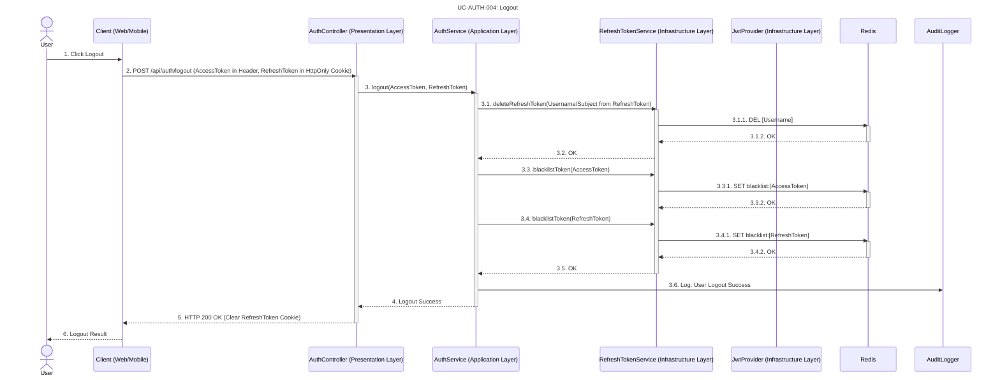

---

layout: single

title: "[Todo] 트러블 슈팅 & TIL (2)"

categories: Spring_Project_AI_Todo

toc: true

toc_sticky: true

author_profile:

sidebar:

tags:

---
# Test

```mermaid
sequenceDiagram
    title UC-AUTH-004: Logout
    actor User
    participant Client as Client (Web/Mobile)
    participant AuthController as AuthController (Presentation Layer)
    participant AuthService as AuthService (Application Layer)
    participant RefreshTokenService as RefreshTokenService (Infrastructure Layer)
    participant JwtProvider as JwtProvider (Infrastructure Layer)
    participant Redis
    participant AuditLogger

    User->>Client: 1. Click Logout
    Client->>AuthController: 2. POST /api/auth/logout (AccessToken in Header, RefreshToken in HttpOnly Cookie)
    activate AuthController
    AuthController->>AuthService: 3. logout(AccessToken, RefreshToken)
    activate AuthService
    AuthService->>RefreshTokenService: 3.1. deleteRefreshToken(Username/Subject from RefreshToken)
    activate RefreshTokenService
    RefreshTokenService->>Redis: 3.1.1. DEL [Username]
    activate Redis
    Redis-->>RefreshTokenService: 3.1.2. OK
    deactivate Redis
    RefreshTokenService-->>AuthService: 3.2. OK

    AuthService->>RefreshTokenService: 3.3. blacklistToken(AccessToken)
    RefreshTokenService->>Redis: 3.3.1. SET blacklist:[AccessToken]
    activate Redis
    Redis-->>RefreshTokenService: 3.3.2. OK
    deactivate Redis
    AuthService->>RefreshTokenService: 3.4. blacklistToken(RefreshToken)
    RefreshTokenService->>Redis: 3.4.1. SET blacklist:[RefreshToken]
    activate Redis
    Redis-->>RefreshTokenService: 3.4.2. OK
    deactivate Redis
    RefreshTokenService-->>AuthService: 3.5. OK
    deactivate RefreshTokenService
    AuthService->>AuditLogger: 3.6. Log: User Logout Success
    AuthService-->>AuthController: 4. Logout Success
    deactivate AuthService
    AuthController-->>Client: 5. HTTP 200 OK (Clear RefreshToken Cookie)
    deactivate AuthController
    Client-->>User: 6. Logout Result
```