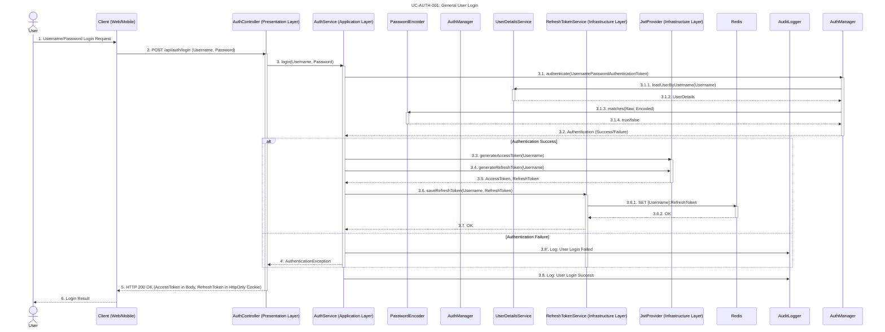
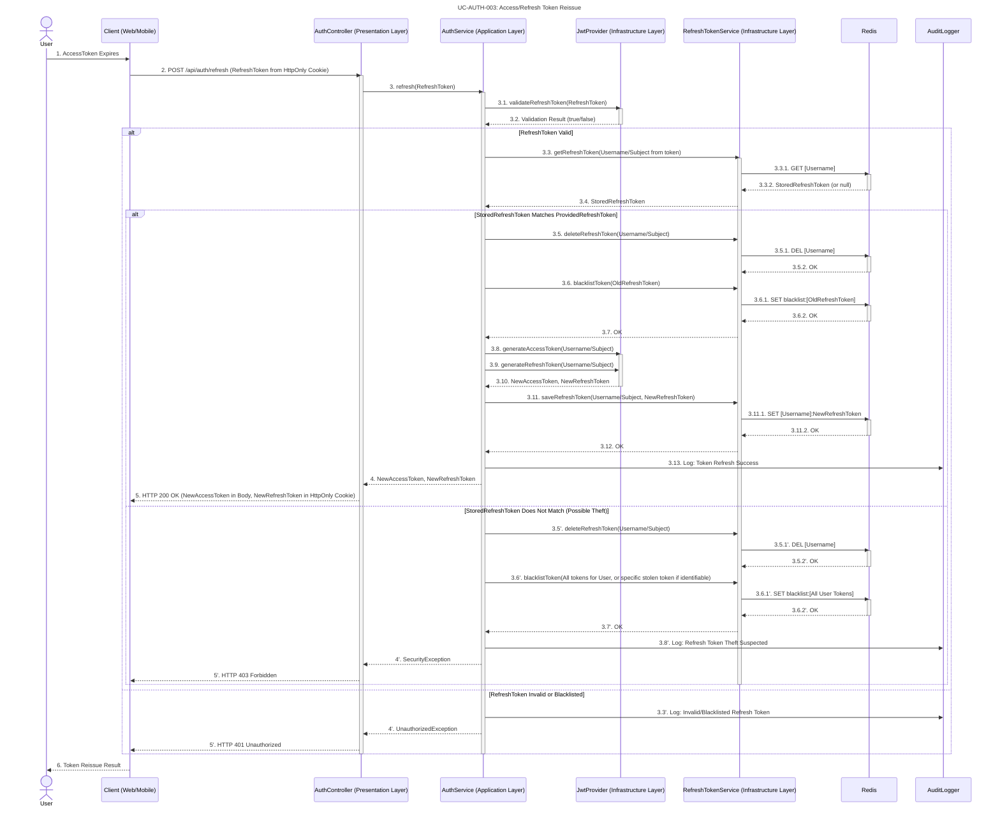
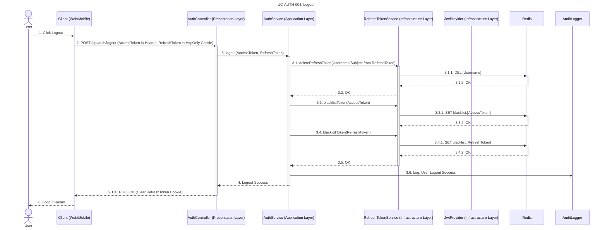

# Auth & OAuth2

## UseCase

### 1. UC-AUTH-001: 일반 사용자 로그인 (General User Login)




### 2. UC-AUTH-002: OAuth2 (Google) 로그인 (OAuth2 (Google) Login)

```mermaid
sequenceDiagram
    title UC-AUTH-002: OAuth2 (Google) Login
    actor User
    participant Client as Client (Web/Mobile)
    participant OAuth2 Provider as OAuth2 Provider (e.g., Google)
    participant AuthController as AuthController (Presentation Layer)
    participant SecurityFilter as Spring Security Filter Chain
    participant CookieAuthReqRepo as CookieOAuth2AuthorizationRequestRepository
    participant OAuth2UserService as CustomOAuth2UserService
    participant UserService as UserService (Application Layer)
    participant UserRepo as UserRepository (Infrastructure Layer)
    participant OAuth2AuthSuccessHandler as OAuth2AuthenticationSuccessHandler
    participant JwtProvider as JwtProvider (Infrastructure Layer)
    participant RefreshTokenService as RefreshTokenService (Infrastructure Layer)
    participant Redis
    participant AuditLogger

    User->>Client: 1. Click "Login with Google"
    Client->>SecurityFilter: 2. Redirect to /oauth2/authorization/google
    activate SecurityFilter
    SecurityFilter->>CookieAuthReqRepo: 2.1. saveAuthorizationRequest()
    activate CookieAuthReqRepo
    CookieAuthReqRepo-->>SecurityFilter: 2.2. OAuth2AuthRequest (in HttpOnly cookie)
    deactivate CookieAuthReqRepo
    SecurityFilter->>OAuth2 Provider: 2.3. Redirect for Authorization
    deactivate SecurityFilter

    OAuth2 Provider->>User: 3. Google Login/Consent Page
    User->>OAuth2 Provider: 4. Authorize Application
    OAuth2 Provider->>Client: 5. Redirect back with Authorization Code to /login/oauth2/code/google

    Client->>SecurityFilter: 6. Callback with Authorization Code
    activate SecurityFilter
    SecurityFilter->>CookieAuthReqRepo: 6.1. removeAuthorizationRequest()
    activate CookieAuthReqRepo
    CookieAuthReqRepo-->>SecurityFilter: 6.2. OAuth2AuthRequest (from cookie)
    deactivate CookieAuthReqRepo
    SecurityFilter->>OAuth2UserService: 6.3. loadUser(OAuth2UserRequest)
    activate OAuth2UserService
    OAuth2UserService->>UserService: 6.3.1. processOAuth2User(OAuth2User)
    activate UserService
    UserService->>UserRepo: 6.3.1.1. findByEmailOrCreate(email)
    activate UserRepo
    UserRepo-->>UserService: 6.3.1.2. User Entity
    deactivate UserRepo
    UserService-->>OAuth2UserService: 6.3.2. OAuth2UserPrincipal
    deactivate UserService
    OAuth2UserService-->>SecurityFilter: 6.4. Authentication (OAuth2UserPrincipal)
    deactivate OAuth2UserService
    SecurityFilter->>OAuth2AuthSuccessHandler: 6.5. onAuthenticationSuccess()
    activate OAuth2AuthSuccessHandler
    OAuth2AuthSuccessHandler->>JwtProvider: 6.5.1. generateAccessToken(UserPrincipal)
    activate JwtProvider
    OAuth2AuthSuccessHandler->>JwtProvider: 6.5.2. generateRefreshToken(UserPrincipal)
    JwtProvider-->>OAuth2AuthSuccessHandler: 6.5.3. AccessToken, RefreshToken
    deactivate JwtProvider
    OAuth2AuthSuccessHandler->>RefreshTokenService: 6.5.4. saveRefreshToken(UserPrincipal, RefreshToken)
    activate RefreshTokenService
    RefreshTokenService->>Redis: 6.5.4.1. SET [Username]:RefreshToken
    activate Redis
    Redis-->>RefreshTokenService: 6.5.4.2. OK
    deactivate Redis
    RefreshTokenService-->>OAuth2AuthSuccessHandler: 6.5.5. OK
    deactivate RefreshTokenService
    OAuth2AuthSuccessHandler->>AuditLogger: 6.5.6. Log: OAuth2 Login Success
    OAuth2AuthSuccessHandler-->>Client: 6.6. Redirect with Tokens (AccessToken in URL Fragment, RefreshToken in HttpOnly Cookie)
    deactivate OAuth2AuthSuccessHandler
    deactivate SecurityFilter

    Client-->>User: 7. OAuth2 Login Result (Redirected to Dashboard)
```


### 3. UC-AUTH-003: Access/Refresh Token 재발급 (Access/Refresh Token Reissue)



### 4. UC-AUTH-004: 로그아웃 (Logout)



