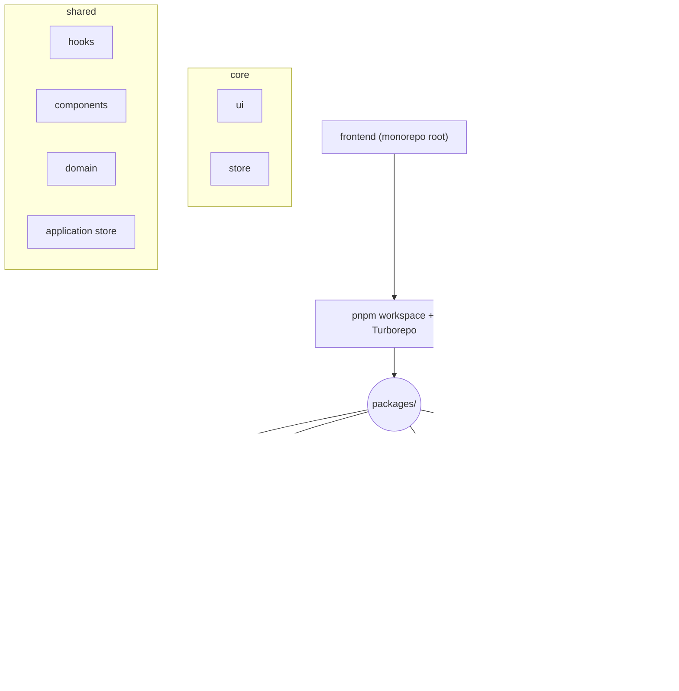

# 테스트

```mermaid
graph TD;
    root["frontend (monorepo root)"] --> pnpm["pnpm workspace + Turborepo"];
    pnpm --> packages(("packages/"));
    packages --> core["core\n(ui, store)"];
    packages --> shared["shared\n(domain, hooks, components, application store)"];
    packages --> webapp["web-app (React + Vite)"];
    packages --> mobile["mobile-app (placeholder)"];
    webapp --> shared;
    shared --> core;
    subgraph core_details[core]
        core_ui[ui];
        core_store[store];
    end;
    subgraph shared_details[shared]
        shared_hooks[hooks];
        shared_components[components];
        shared_domain[domain];
        shared_app[application store];
    end;
    webapp --- vite[Vite config + tsconfigPaths];
```